# COMPARATIVA COMPLETA: MERMAID VS PLANTUML
## Guía de Decisión - Cantina TITA

---

## 🎯 Recomendación Ejecutiva

### **USA MERMAID** si:
- ✅ Quieres documentación versionada en Git
- ✅ Necesitas que se vea en GitHub/GitLab
- ✅ Simplicidad > Complejidad
- ✅ Diagramas para equipo (fácil de leer/editar)
- ✅ Integración nativa con Markdown

### **USA PLANTUML** si:
- ✅ Necesitas UML completo y profesional
- ✅ Diagramas técnicos complejos (clases con herencia)
- ✅ Exportación de calidad editorial
- ✅ Documentación técnica formal
- ✅ Más control de personalización visual

### **USA AMBOS** (recomendado):
- 🎯 **Mermaid** para README, docs/, wiki
- 🎯 **PlantUML** para arquitectura técnica detallada

---

## 📊 Comparativa Técnica Detallada

| Característica | Mermaid ⚡ | PlantUML 🔧 | Ganador |
|----------------|-----------|------------|---------|
| **Instalación** | Sin dependencias | Requiere Java | Mermaid |
| **Sintaxis** | Simple, basada en Markdown | Más verbose | Mermaid |
| **Curva aprendizaje** | 15 minutos | 2-3 horas | Mermaid |
| **Renderizado** | JavaScript en navegador | Servidor/local | Mermaid |
| **GitHub nativo** | ✅ Sí | ❌ No | Mermaid |
| **GitLab nativo** | ✅ Sí | ✅ Sí | Empate |
| **Exportación** | PNG/SVG (con extensión) | PNG/SVG/PDF/EPS | PlantUML |
| **Calidad export** | Buena (depende browser) | Excelente | PlantUML |
| **Personalización** | Limitada (temas básicos) | Extensa (skins, colores) | PlantUML |
| **UML completo** | Parcial (ERD, seq, use case) | Completo (todos los tipos) | PlantUML |
| **Herencia clases** | ❌ No soportado | ✅ Full OOP | PlantUML |
| **Actividad** | ❌ No tiene | ✅ Avanzado | PlantUML |
| **Timing diagrams** | ❌ No | ✅ Sí | PlantUML |
| **Archimate** | ❌ No | ✅ Sí | PlantUML |
| **Mantenimiento** | Muy activo (Microsoft) | Muy activo | Empate |
| **Comunidad** | Grande (JavaScript) | Grande (Java) | Empate |
| **Performance** | Rápido (cliente) | Lento (servidor) | Mermaid |
| **Offline** | ✅ Funciona | ⚠️ Necesita config | Mermaid |
| **Diff en Git** | Texto legible | Texto legible | Empate |
| **Edición visual** | ❌ Solo código | ⚠️ Terceros | - |

---

## 📋 Comparativa por Tipo de Diagrama

### 1️⃣ Diagrama Entidad-Relación (ERD)

#### Mermaid ⭐⭐⭐⭐⭐
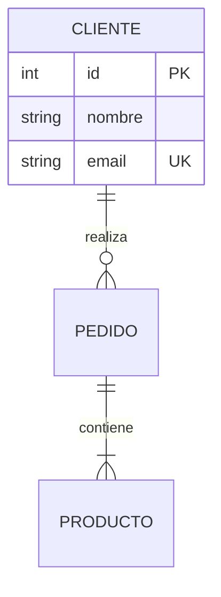
**✅ Pros**: Sintaxis clara, cardinalidad visual, campos en tabla  
**❌ Cons**: No soporta herencia, sin tipos de relación complejos  
**🎯 Uso**: ERD de bases de datos relacionales (80% de casos)

#### PlantUML ⭐⭐⭐
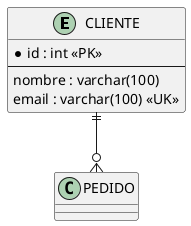
**✅ Pros**: Más control visual, soporta métodos  
**❌ Cons**: Más verboso, menos intuitivo  
**🎯 Uso**: ERD con lógica de negocio

**🏆 GANADOR**: **Mermaid** (simplicidad y legibilidad)

---

### 2️⃣ Diagrama de Secuencia

#### Mermaid ⭐⭐⭐⭐⭐
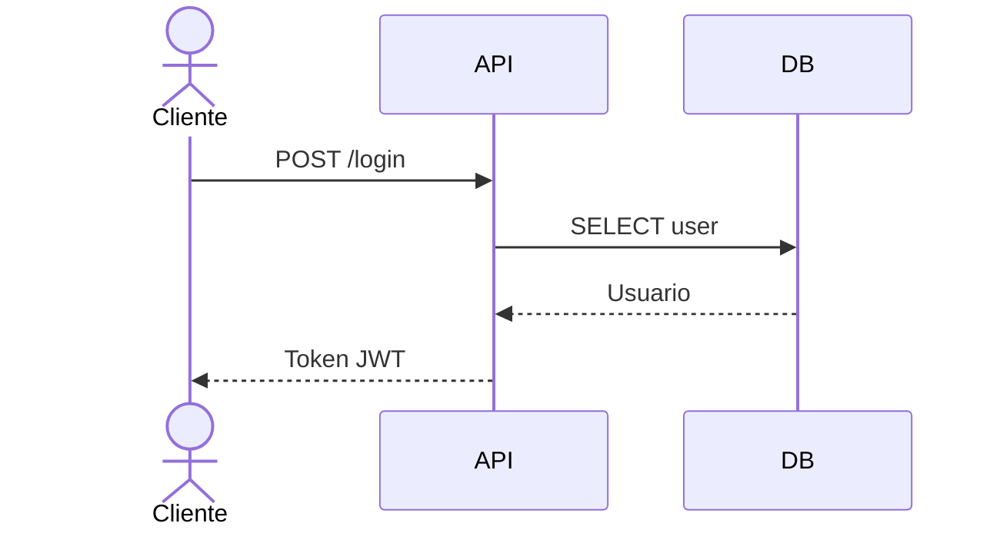
**✅ Pros**: Actor nativo, loops/alt simples, notas fáciles  
**❌ Cons**: Activaciones automáticas (menos control)  
**🎯 Uso**: Flujos de API, casos de uso, integraciones

#### PlantUML ⭐⭐⭐⭐⭐
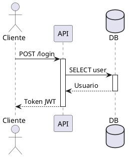
**✅ Pros**: Control total de activaciones, timing diagrams  
**❌ Cons**: Más código para lo mismo  
**🎯 Uso**: Secuencias complejas con timing crítico

**🏆 GANADOR**: **Empate** (Mermaid más simple, PlantUML más potente)

---

### 3️⃣ Diagrama de Clases (UML)

#### Mermaid ⭐⭐
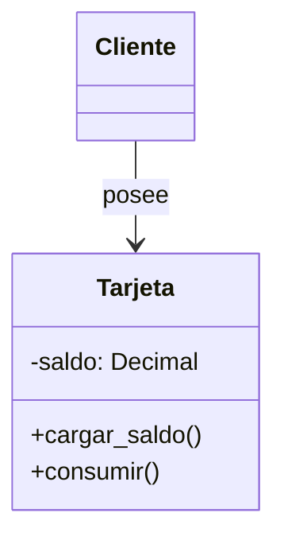
**✅ Pros**: Sintaxis razonable, visualización clara  
**❌ Cons**: Sin herencia múltiple, sin templates, sin packages  
**🎯 Uso**: Clases simples, sin OOP avanzado

#### PlantUML ⭐⭐⭐⭐⭐
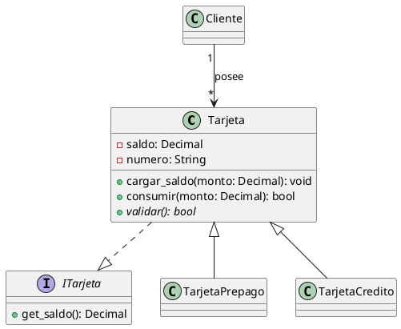
**✅ Pros**: UML completo, herencia, interfaces, abstract, templates  
**❌ Cons**: Más complejo de aprender  
**🎯 Uso**: Arquitectura OOP real, diseño de software

**🏆 GANADOR**: **PlantUML** (sin competencia)

---

### 4️⃣ Diagrama de Casos de Uso

#### Mermaid ⭐⭐⭐⭐
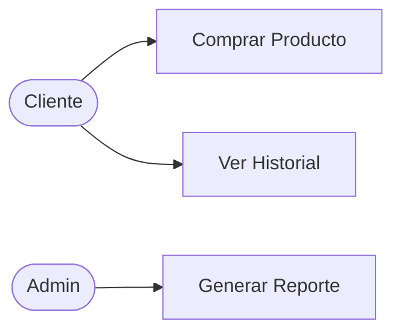
**✅ Pros**: Simple, rápido, claro  
**❌ Cons**: No es UML estándar (hacemos trampas con graph)  
**🎯 Uso**: Documentación ágil, user stories

#### PlantUML ⭐⭐⭐⭐⭐
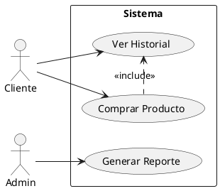
**✅ Pros**: UML estándar, relaciones <<include>>/<<extend>>  
**❌ Cons**: Más código  
**🎯 Uso**: Documentación formal de requisitos

**🏆 GANADOR**: **Mermaid** (pragmatismo) | **PlantUML** (UML puro)

---

### 5️⃣ Diagrama de Estados

#### Mermaid ⭐⭐⭐⭐
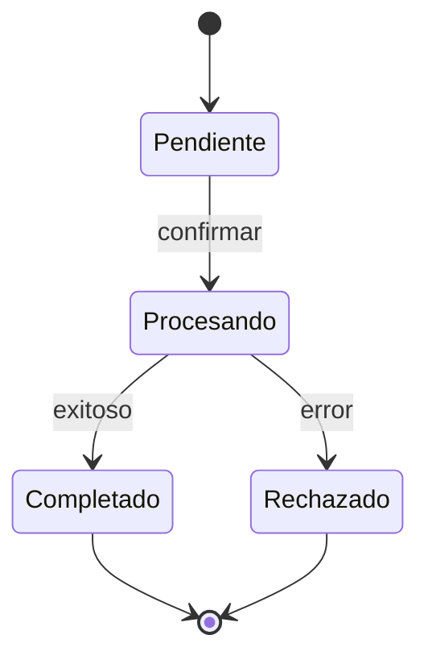
**✅ Pros**: Sintaxis limpia, estados compuestos  
**❌ Cons**: Sin entry/exit actions explícitas  
**🎯 Uso**: Estados de negocio, workflows

#### PlantUML ⭐⭐⭐⭐⭐
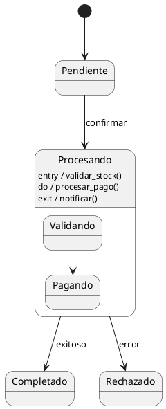
**✅ Pros**: Entry/do/exit actions, estados compuestos avanzados  
**❌ Cons**: Más verboso  
**🎯 Uso**: Máquinas de estado complejas

**🏆 GANADOR**: **PlantUML** (control completo)

---

### 6️⃣ Diagrama de Componentes

#### Mermaid ⭐⭐⭐
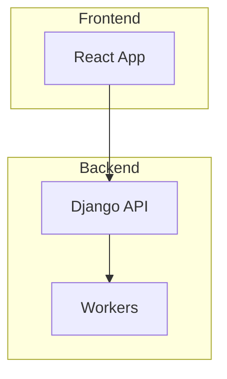
**✅ Pros**: Visual, flexible, rápido  
**❌ Cons**: No es UML estándar  
**🎯 Uso**: Arquitectura de alto nivel

#### PlantUML ⭐⭐⭐⭐⭐
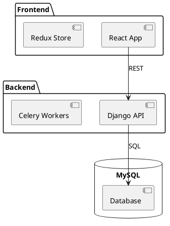
**✅ Pros**: UML estándar, interfaces, puertos  
**❌ Cons**: Curva de aprendizaje  
**🎯 Uso**: Arquitectura de software formal

**🏆 GANADOR**: **PlantUML** (arquitectura profesional)

---

### 7️⃣ Diagrama de Deployment

#### Mermaid ⭐⭐
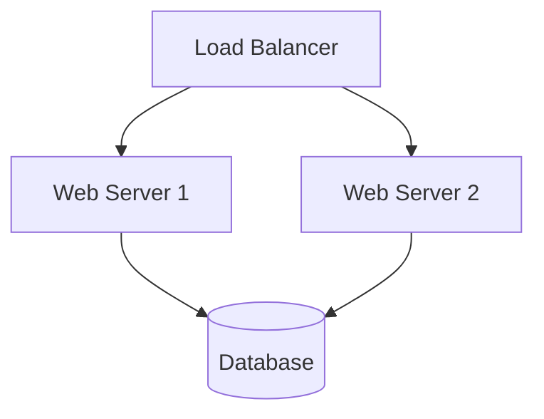
**✅ Pros**: Simple y visual  
**❌ Cons**: No diferencia nodos/componentes  
**🎯 Uso**: Diagrama conceptual

#### PlantUML ⭐⭐⭐⭐⭐
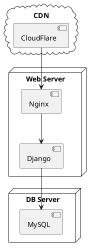
**✅ Pros**: Diferencia nodos/componentes/artifacts  
**❌ Cons**: Más complejo  
**🎯 Uso**: Deployment real (DevOps)

**🏆 GANADOR**: **PlantUML** (deployment serio)

---

### 8️⃣ Gantt / Timeline

#### Mermaid ⭐⭐⭐⭐⭐
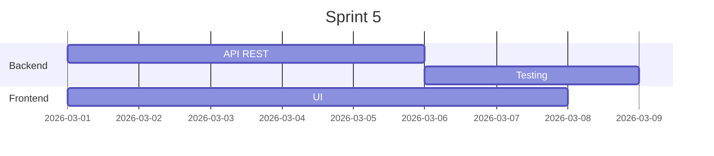
**✅ Pros**: Simple, visual, milestones  
**❌ Cons**: Limitado a Gantt básico  
**🎯 Uso**: Planning de sprints, roadmaps

#### PlantUML ⭐⭐⭐
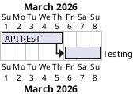
**✅ Pros**: Gantt funcional  
**❌ Cons**: Menos features que Mermaid  
**🎯 Uso**: Planning simple

**🏆 GANADOR**: **Mermaid** (mejor Gantt)

---

### 9️⃣ Flowchart / Diagrama de Flujo

#### Mermaid ⭐⭐⭐⭐⭐
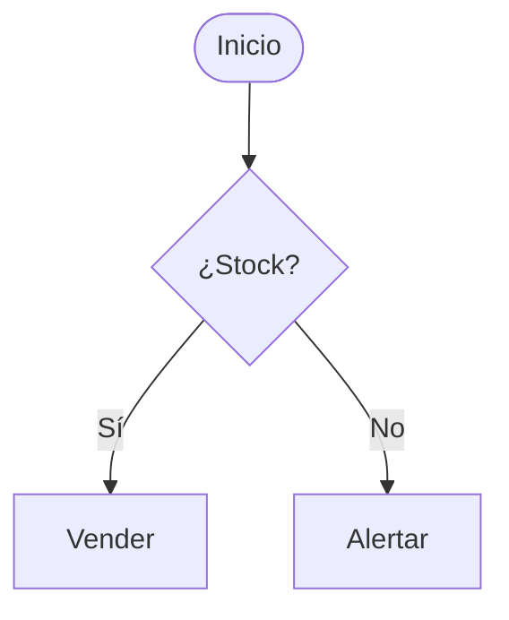
**✅ Pros**: Sintaxis intuitiva, formas variadas  
**❌ Cons**: Ninguno significativo  
**🎯 Uso**: Procesos de negocio, lógica

#### PlantUML ⭐⭐⭐⭐
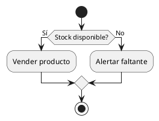
**✅ Pros**: Activity diagram UML  
**❌ Cons**: Más verboso  
**🎯 Uso**: Procesos formales

**🏆 GANADOR**: **Mermaid** (simplicidad)

---

### 🔟 Diagrama de Actividad

#### Mermaid ❌
**No soportado nativamente**

#### PlantUML ⭐⭐⭐⭐⭐
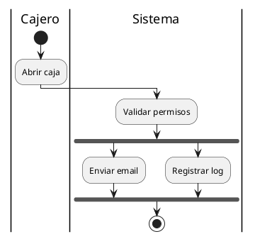
**✅ Pros**: Swimlanes, forks, particiones  
**❌ Cons**: Solo PlantUML lo tiene  
**🎯 Uso**: Procesos multi-actor

**🏆 GANADOR**: **PlantUML** (único con activity)

---

## 🎯 Matriz de Decisión

| Tu Necesidad | Herramienta Recomendada |
|--------------|------------------------|
| **README.md en GitHub** | Mermaid ⚡ |
| **Documentación API** | Mermaid ⚡ |
| **Arquitectura Django (modelos)** | PlantUML 🔧 |
| **Flujos de negocio** | Mermaid ⚡ |
| **UML formal (clases con herencia)** | PlantUML 🔧 |
| **Deployment infraestructura** | PlantUML 🔧 |
| **Planning (Gantt)** | Mermaid ⚡ |
| **Estados de entidades** | PlantUML 🔧 |
| **Diagramas para presentaciones** | PlantUML 🔧 (exporta mejor) |
| **Diagramas para equipo** | Mermaid ⚡ (más fácil leer) |
| **Integración CI/CD** | Mermaid ⚡ (sin deps) |
| **Documentación offline** | Mermaid ⚡ |

---

## 💰 Esfuerzo vs Valor

```
Alta Calidad UML │                    PlantUML
                 │                      ★
                 │                    
                 │              
Calidad          │        
                 │    Mermaid
                 │      ★
                 │  
Baja Calidad     │________________________
                    Bajo     Alto
                      Esfuerzo
```

**Conclusión**: 
- **Mermaid** = Máximo valor con mínimo esfuerzo (80% de casos)
- **PlantUML** = Máxima calidad cuando lo necesitas (20% de casos)

---

## 🏆 Recomendación Final para Cantina TITA

### Estrategia Dual (Mejor de ambos mundos)

#### 📁 Estructura de archivos
```
docs/
├── ARQUITECTURA.md              (Mermaid - ERD, alta nivel)
├── DIAGRAMAS_CARTA.md           (Mermaid - para imprimir)
├── GUIA_DIAGRAMAS.md            (Guía de uso)
└── arquitectura/
    ├── modelos/
    │   ├── core.puml            (PlantUML - Clases detalladas)
    │   ├── ventas.puml
    │   └── inventario.puml
    ├── secuencias/
    │   ├── pago-online.puml     (PlantUML - Flujos críticos)
    │   └── cierre-caja.puml
    └── deployment/
        └── produccion.puml      (PlantUML - Infraestructura)
```

#### 📋 Reglas de uso
1. **Usar Mermaid por defecto** en archivos `.md`
2. **Usar PlantUML** cuando necesites:
   - Diagramas de clases con métodos Django
   - Diagramas de componentes detallados
   - Deployment con nodos específicos
   - Activity diagrams con swimlanes
   - Exportación de calidad editorial

3. **Versionarlos juntos**:
   - Código Mermaid en Markdown (se ve en GitHub)
   - Código PlantUML en `.puml` + SVG exportado (se incluye en docs)

#### 🚀 Beneficios
✅ Equipo puede leer/editar Mermaid fácilmente  
✅ Arquitectos tienen PlantUML para diseño formal  
✅ GitHub muestra Mermaid automáticamente  
✅ Presentaciones usan SVG de PlantUML (alta calidad)  
✅ Lo mejor de ambos mundos  

---

## ✅ Tu Setup Actual (Listo para usar)

🎉 Ya tienes configurado:
- ✅ Mermaid nativo en Markdown
- ✅ PlantUML con exportación automática
- ✅ Snippets para ambos
- ✅ Ejemplos en `docs/EJEMPLOS_PLANTUML.md`
- ✅ Guía rápida en `docs/GUIA_DIAGRAMAS.md`

**¡Ahora puedes crear CUALQUIER diagrama profesional! 🚀**
