# DER Por Modulos (db_table/db_column) - Sin Tablas Django

Generado: 2026-03-06 21:13:11

Incluye todas las tablas por modulo usando nombres reales de BD (`db_table`, `db_column`).
No incluye tablas internas de Django.

## Modulo: almuerzos

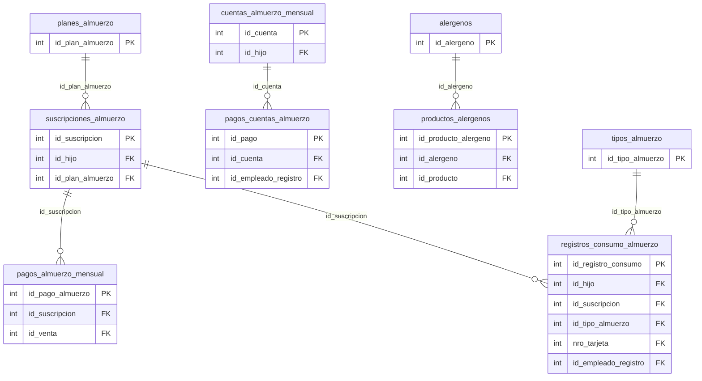

## Modulo: api_integrations

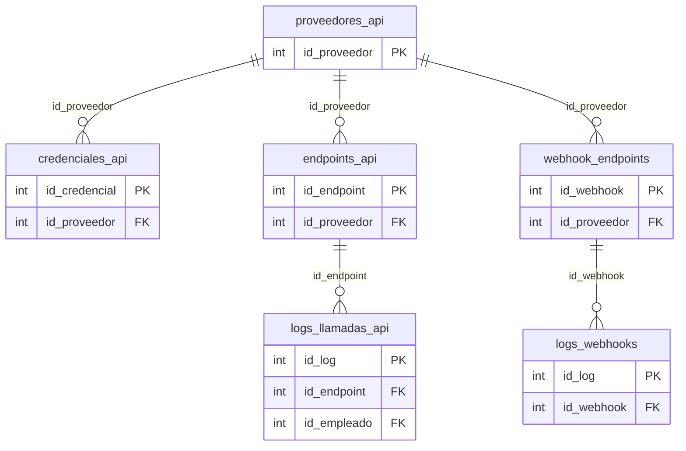

## Modulo: clientes

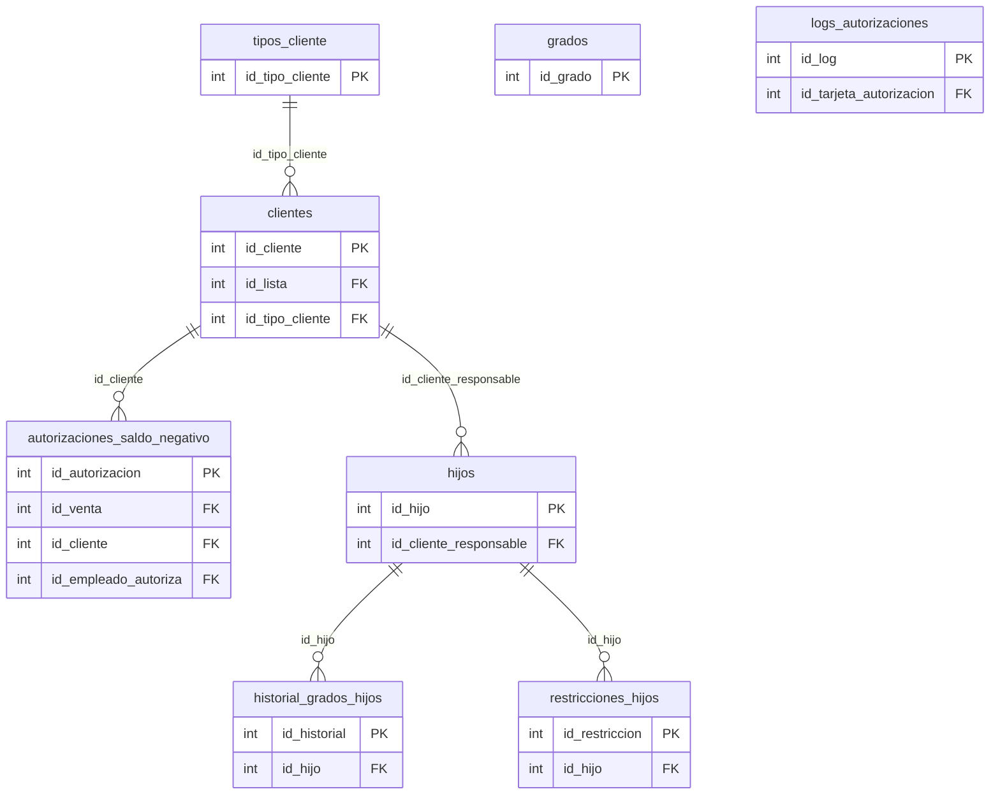

## Modulo: compras

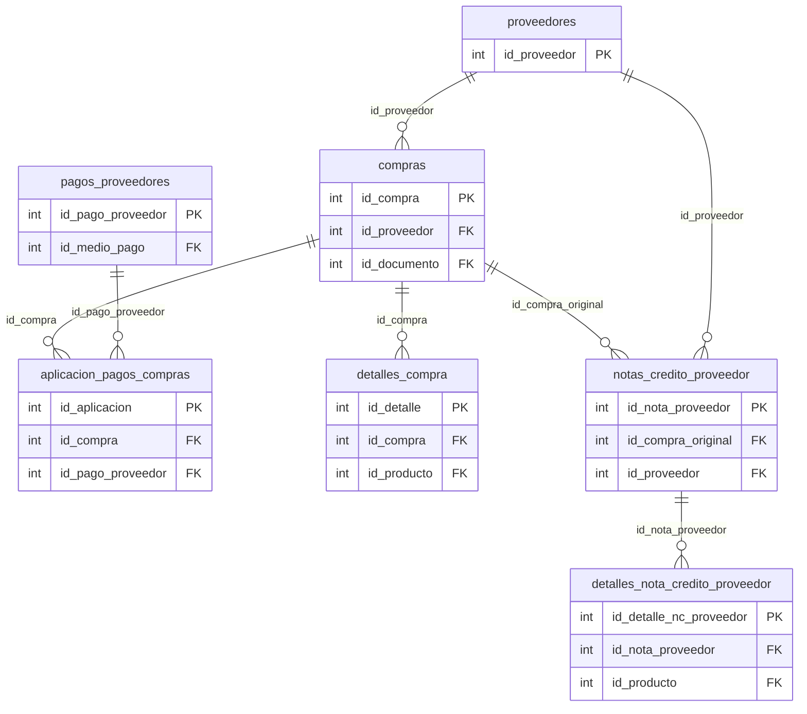

## Modulo: contabilidad

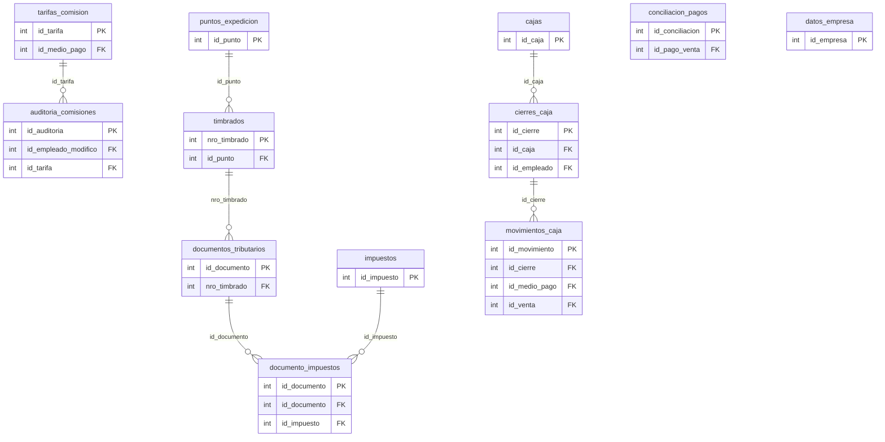

## Modulo: core

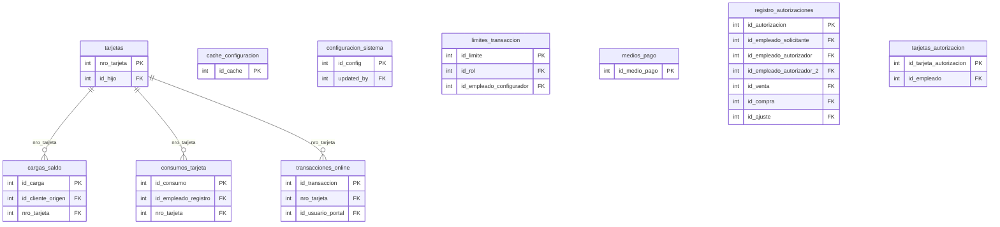

## Modulo: inventario

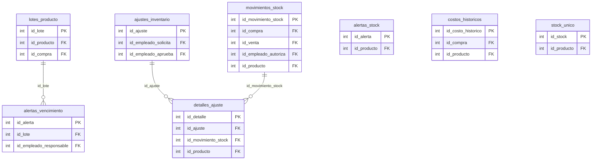

## Modulo: notificaciones

```mermaid
erDiagram
    alertas_automaticas ||--o{ alerta_destinatarios : id_alerta
    plantillas_email ||--o{ campanas_comunicacion : id_email_template
    plantillas_sms ||--o{ campanas_comunicacion : id_sms_template
    plantillas_email ||--o{ emails_enviados : id_template
    alertas_automaticas ||--o{ historial_alertas : id_alerta
    plantillas_sms ||--o{ sms_enviados : id_template

    alerta_destinatarios {
        int id_destinatario PK
        int id_alerta FK
        int id_empleado FK
    }

    alertas_automaticas {
        int id_alerta PK
    }

    alertas_sistema {
        int id_alerta PK
    }

    anomalias_detectadas {
        int id_anomalia PK
    }

    campanas_comunicacion {
        int id_campana PK
        int created_by FK
        int id_email_template FK
        int id_sms_template FK
    }

    emails_enviados {
        int id_email PK
        int id_cliente FK
        int enviado_por FK
        int id_template FK
    }

    historial_alertas {
        int id_historial PK
        int id_alerta FK
        int resuelto_por FK
    }

    notificaciones_portal {
        int id_notificacion PK
        int id_usuario_portal FK
    }

    notificaciones_saldo {
        int id_notificacion PK
        int nro_tarjeta FK
    }

    plantillas_email {
        int id_template PK
        int created_by FK
    }

    plantillas_sms {
        int id_template PK
    }

    preferencias_notificacion {
        int id_preferencia PK
        int id_usuario_portal FK
    }

    restricciones_horarias {
        int id_restriccion PK
    }

    sms_enviados {
        int id_sms PK
        int id_cliente FK
        int enviado_por FK
        int id_template FK
    }

    solicitudes_notificacion {
        int id_solicitud PK
        int id_cliente FK
        int nro_tarjeta FK
    }

```

## Modulo: productos

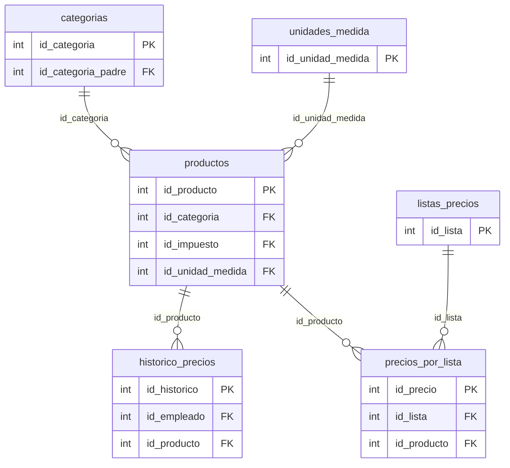

## Modulo: reportes

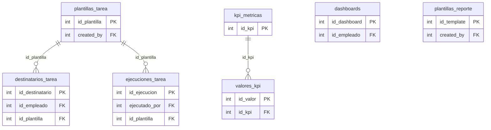

## Modulo: usuarios

```mermaid
erDiagram
    empleados ||--o{ auditoria_empleados : id_empleado
    roles ||--o{ empleados : id_rol
    empleados ||--o{ perfiles_usuario : id_empleado
    roles ||--o{ roles_permisos : id_rol
    permisos ||--o{ roles_permisos : id_permiso
    empleados ||--o{ roles_permisos : asignado_por
    usuarios_portal ||--o{ tokens_verificacion : id_usuario_portal

    auditoria_empleados {
        int id_auditoria PK
        int id_empleado FK
    }

    auditoria_operaciones {
        int id_auditoria PK
    }

    auditoria_usuarios_web {
        int id_auditoria PK
        int id_cliente FK
    }

    autenticacion_2fa {
        int id_2fa PK
    }

    bloqueos_cuenta {
        int id_bloqueo PK
    }

    empleados {
        int id_empleado PK
        int id_rol FK
    }

    intentos_2fa {
        int id_intento PK
    }

    intentos_login {
        int id_intento PK
    }

    patrones_acceso {
        int id_patron PK
    }

    perfiles_usuario {
        int id_perfil PK
        int id_empleado FK
    }

    permisos {
        int id PK
    }

    renovaciones_sesion {
        int id_renovacion PK
    }

    roles {
        int id_rol PK
    }

    roles_permisos {
        int id PK
        int id_rol FK
        int id_permiso FK
        int asignado_por FK
    }

    sesiones_activas {
        int id_sesion PK
    }

    tokens_recuperacion {
        int id_token PK
        int id_cliente FK
    }

    tokens_verificacion {
        int id_token PK
        int id_usuario_portal FK
    }

    usuarios_portal {
        int id_usuario_portal PK
        int id_cliente FK
    }

    usuarios_web_clientes {
        int id_cliente PK
        int id_cliente FK
    }

```

## Modulo: ventas

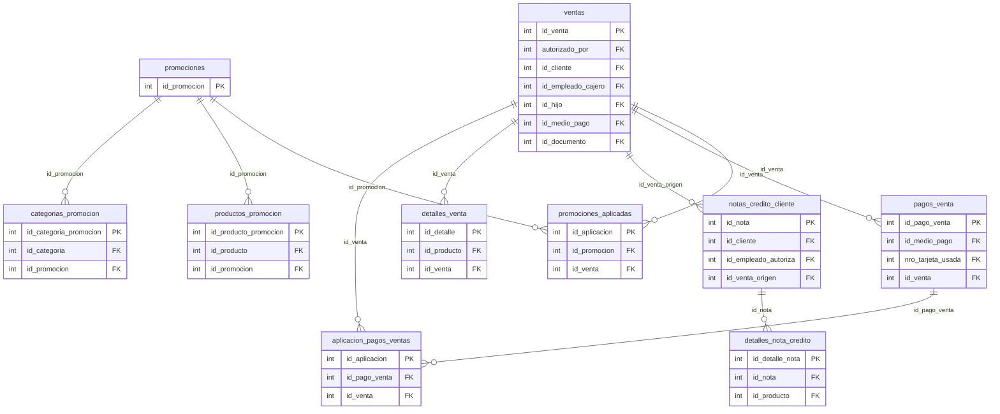

