# DER Por Modulos (Sin Tablas Django)

Generado: 2026-03-06 21:09:24

Incluye todas las tablas detectadas por modulo en `backend/apps`.
Para cada tabla se listan campos PK y FK.

## Modulo: almuerzos

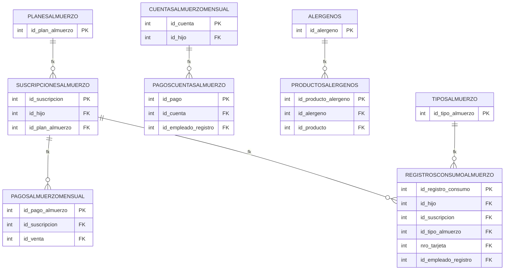

## Modulo: api_integrations

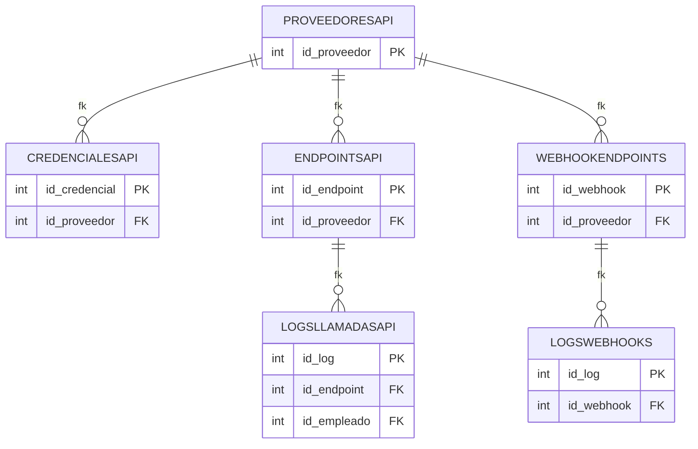

## Modulo: clientes

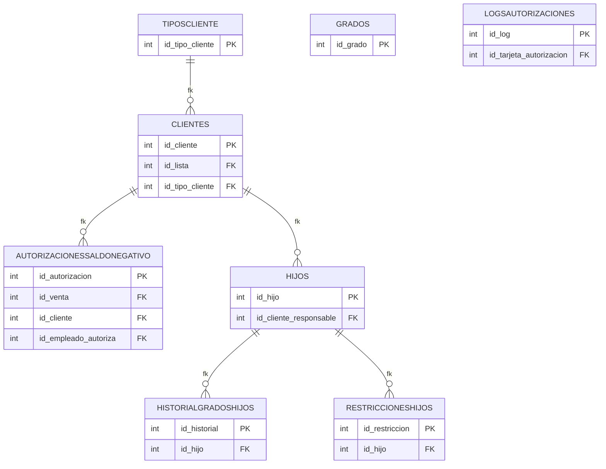

## Modulo: compras

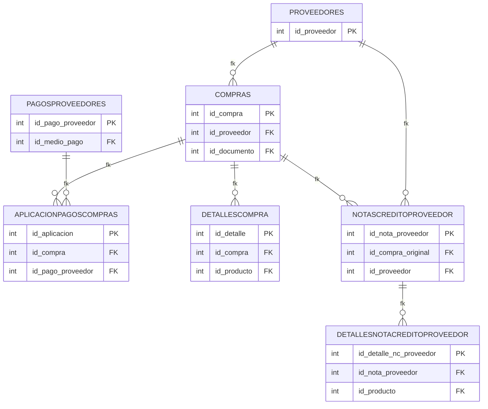

## Modulo: contabilidad

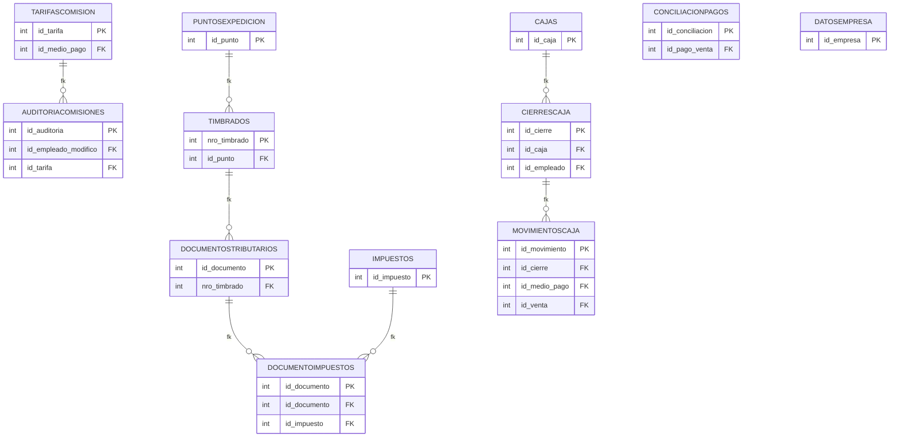

## Modulo: core

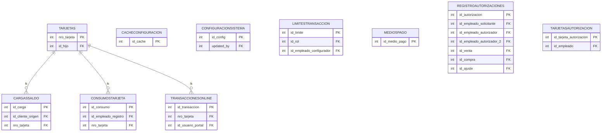

## Modulo: inventario

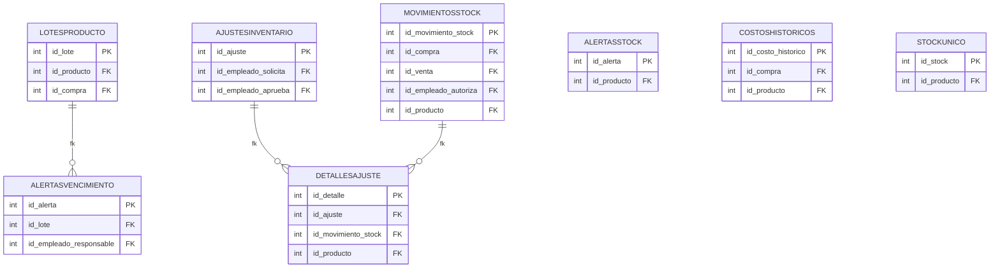

## Modulo: notificaciones

```mermaid
erDiagram
    ALERTASAUTOMATICAS ||--o{ ALERTADESTINATARIOS : fk
    PLANTILLASEMAIL ||--o{ CAMPANASCOMUNICACION : fk
    PLANTILLASSMS ||--o{ CAMPANASCOMUNICACION : fk
    PLANTILLASEMAIL ||--o{ EMAILSENVIADOS : fk
    ALERTASAUTOMATICAS ||--o{ HISTORIALALERTAS : fk
    PLANTILLASSMS ||--o{ SMSENVIADOS : fk

    ALERTADESTINATARIOS {
        int id_destinatario PK
        int id_alerta FK
        int id_empleado FK
    }

    ALERTASAUTOMATICAS {
        int id_alerta PK
    }

    ALERTASSISTEMA {
        int id_alerta PK
    }

    ANOMALIASDETECTADAS {
        int id_anomalia PK
    }

    CAMPANASCOMUNICACION {
        int id_campana PK
        int created_by FK
        int id_email_template FK
        int id_sms_template FK
    }

    EMAILSENVIADOS {
        int id_email PK
        int id_cliente FK
        int enviado_por FK
        int id_template FK
    }

    HISTORIALALERTAS {
        int id_historial PK
        int id_alerta FK
        int resuelto_por FK
    }

    NOTIFICACIONESPORTAL {
        int id_notificacion PK
        int id_usuario_portal FK
    }

    NOTIFICACIONESSALDO {
        int id_notificacion PK
        int nro_tarjeta FK
    }

    PLANTILLASEMAIL {
        int id_template PK
        int created_by FK
    }

    PLANTILLASSMS {
        int id_template PK
    }

    PREFERENCIASNOTIFICACION {
        int id_preferencia PK
        int id_usuario_portal FK
    }

    RESTRICCIONESHORARIAS {
        int id_restriccion PK
    }

    SMSENVIADOS {
        int id_sms PK
        int id_cliente FK
        int enviado_por FK
        int id_template FK
    }

    SOLICITUDESNOTIFICACION {
        int id_solicitud PK
        int id_cliente FK
        int nro_tarjeta FK
    }

```

## Modulo: productos

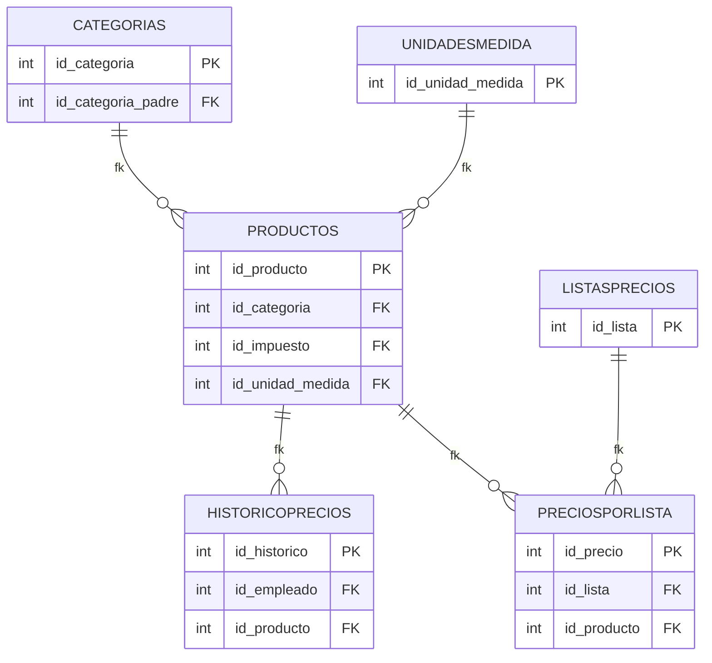

## Modulo: reportes

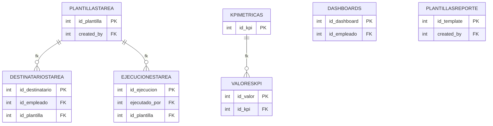

## Modulo: usuarios

```mermaid
erDiagram
    EMPLEADOS ||--o{ AUDITORIAEMPLEADOS : fk
    ROLES ||--o{ EMPLEADOS : fk
    EMPLEADOS ||--o{ PERFILESUSUARIO : fk
    ROLES ||--o{ ROLESPERMISOS : fk
    PERMISOS ||--o{ ROLESPERMISOS : fk
    EMPLEADOS ||--o{ ROLESPERMISOS : fk
    USUARIOSPORTAL ||--o{ TOKENSVERIFICACION : fk

    AUDITORIAEMPLEADOS {
        int id_auditoria PK
        int id_empleado FK
    }

    AUDITORIAOPERACIONES {
        int id_auditoria PK
    }

    AUDITORIAUSUARIOSWEB {
        int id_auditoria PK
        int id_cliente FK
    }

    AUTENTICACION2FA {
        int id_2fa PK
    }

    BLOQUEOSCUENTA {
        int id_bloqueo PK
    }

    EMPLEADOS {
        int id_empleado PK
        int id_rol FK
    }

    INTENTOS2FA {
        int id_intento PK
    }

    INTENTOSLOGIN {
        int id_intento PK
    }

    PATRONESACCESO {
        int id_patron PK
    }

    PERFILESUSUARIO {
        int id_perfil PK
        int id_empleado FK
    }

    PERMISOS {
        int id PK
    }

    RENOVACIONESSESION {
        int id_renovacion PK
    }

    ROLES {
        int id_rol PK
    }

    ROLESPERMISOS {
        int id PK
        int id_rol FK
        int id_permiso FK
        int asignado_por FK
    }

    SESIONESACTIVAS {
        int id_sesion PK
    }

    TOKENSRECUPERACION {
        int id_token PK
        int id_cliente FK
    }

    TOKENSVERIFICACION {
        int id_token PK
        int id_usuario_portal FK
    }

    USUARIOSPORTAL {
        int id_usuario_portal PK
        int id_cliente FK
    }

    USUARIOSWEBCLIENTES {
        int id_cliente PK
        int id_cliente FK
    }

```

## Modulo: ventas

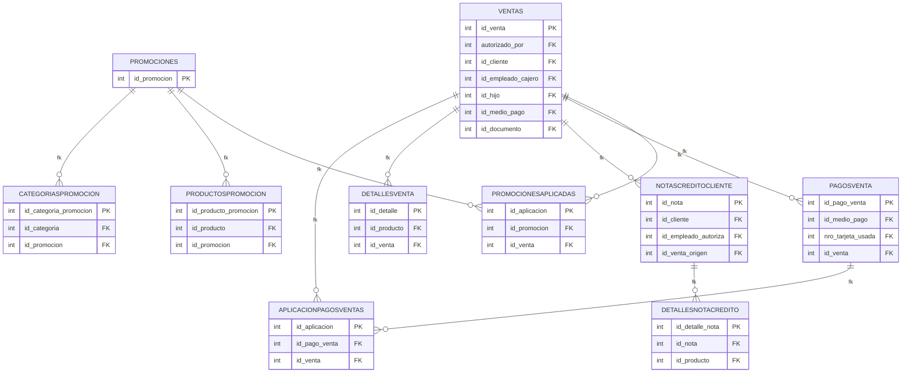

