# DIAGRAMAS DE ARQUITECTURA - SISTEMA CANTINA TITA
## Versión Optimizada para Impresión Tamaño Carta

**Fecha**: 6 de Marzo, 2026  
**Formato**: Letter (8.5" x 11")  
**Orientación**: Portrait (vertical) y Landscape (horizontal) según diagrama  

---

## 📋 ÍNDICE DE DIAGRAMAS

### Diagramas Entidad-Relación (DER)
- [Página 1: DER CORE - Tarjetas (Parte 1)](#der-core-parte-1)
- [Página 2: DER CORE - Tarjetas (Parte 2)](#der-core-parte-2)
- [Página 3: DER CLIENTES](#der-clientes)
- [Página 4: DER PRODUCTOS - Catálogo](#der-productos-catalogo)
- [Página 5: DER INVENTARIO - Stock y Lotes](#der-inventario-stock)
- [Página 6: DER VENTAS - Transacciones](#der-ventas)
- [Página 7: DER ALMUERZOS - Suscripciones](#der-almuerzos)
- [Página 8: DER COMPRAS](#der-compras)
- [Página 9: DER CONTABILIDAD - Cajas](#der-contabilidad-cajas)
- [Página 10: DER CONTABILIDAD - Asientos](#der-contabilidad-asientos)
- [Página 11: DER USUARIOS - Autenticación](#der-usuarios-auth)
- [Página 12: DER USUARIOS - Auditoría](#der-usuarios-auditoria)
- [Página 13: DER REPORTES](#der-reportes)
- [Página 14: DER NOTIFICACIONES](#der-notificaciones)
- [Página 15: DER API INTEGRATIONS](#der-api-integrations)

### Diagramas de Casos de Uso
- [Página 16: Casos de Uso - Clientes y Tarjetas](#casos-uso-clientes)
- [Página 17: Casos de Uso - Ventas y Almuerzos](#casos-uso-ventas)
- [Página 18: Casos de Uso - Inventario y Compras](#casos-uso-inventario)
- [Página 19: Casos de Uso - Administración](#casos-uso-admin)

### Diagramas de Secuencia
- [Página 20: Secuencia - Carga Online (Parte 1)](#secuencia-carga-online-1)
- [Página 21: Secuencia - Carga Online (Parte 2)](#secuencia-carga-online-2)
- [Página 22: Secuencia - Venta POS](#secuencia-venta-pos)
- [Página 23: Secuencia - Detección Anomalías](#secuencia-anomalias)

### Diagrama de Despliegue
- [Página 24: Arquitectura de Despliegue](#arquitectura-despliegue)

---

## DER CORE (Parte 1)
### Módulo CORE - Tarjetas y Cargas

**Entidades**: TARJETAS, CARGAS_SALDO, CONSUMOS_TARJETA, MEDIOS_PAGO

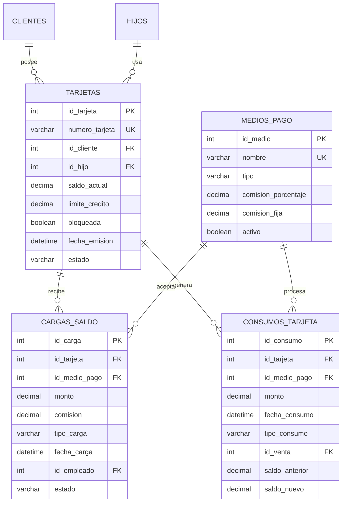
```mermaid
erDiagram
    CLIENTES ||--o{ TARJETAS : posee
    HIJOS ||--o{ TARJETAS : usa
    TARJETAS ||--o{ CARGAS_SALDO : recibe
    TARJETAS ||--o{ CONSUMOS_TARJETA : genera
    MEDIOS_PAGO ||--o{ CARGAS_SALDO : acepta
    MEDIOS_PAGO ||--o{ CONSUMOS_TARJETA : procesa
    
    TARJETAS {
        int id_tarjeta PK
        varchar numero_tarjeta UK
        int id_cliente FK
        int id_hijo FK
        decimal saldo_actual
        decimal limite_credito
        boolean bloqueada
        datetime fecha_emision
        varchar estado
    }
    
    CARGAS_SALDO {
        int id_carga PK
        int id_tarjeta FK
        int id_medio_pago FK
        decimal monto
        decimal comision
        varchar tipo_carga
        datetime fecha_carga
        int id_empleado FK
        varchar estado
    }
    
    CONSUMOS_TARJETA {
        int id_consumo PK
        int id_tarjeta FK
        int id_medio_pago FK
        decimal monto
        datetime fecha_consumo
        varchar tipo_consumo
        int id_venta FK
        decimal saldo_anterior
        decimal saldo_nuevo
    }
    
    MEDIOS_PAGO {
        int id_medio PK
        varchar nombre UK
        varchar tipo
        decimal comision_porcentaje
        decimal comision_fija
        boolean activo
    }
```

**Descripción**:
- Una tarjeta pertenece a un cliente y es usada por un hijo
- Soporta múltiples cargas de saldo con diferentes medios de pago
- Registra cada consumo con saldo antes/después para auditoría
- Comisiones configurables por medio de pago

---

## DER CORE (Parte 2)
### Módulo CORE - Autorizaciones y Límites

**Entidades**: TARJETAS_AUTORIZACION, LIMITES_TRANSACCION, REGISTRO_AUTORIZACIONES, TRANSACCIONES_ONLINE

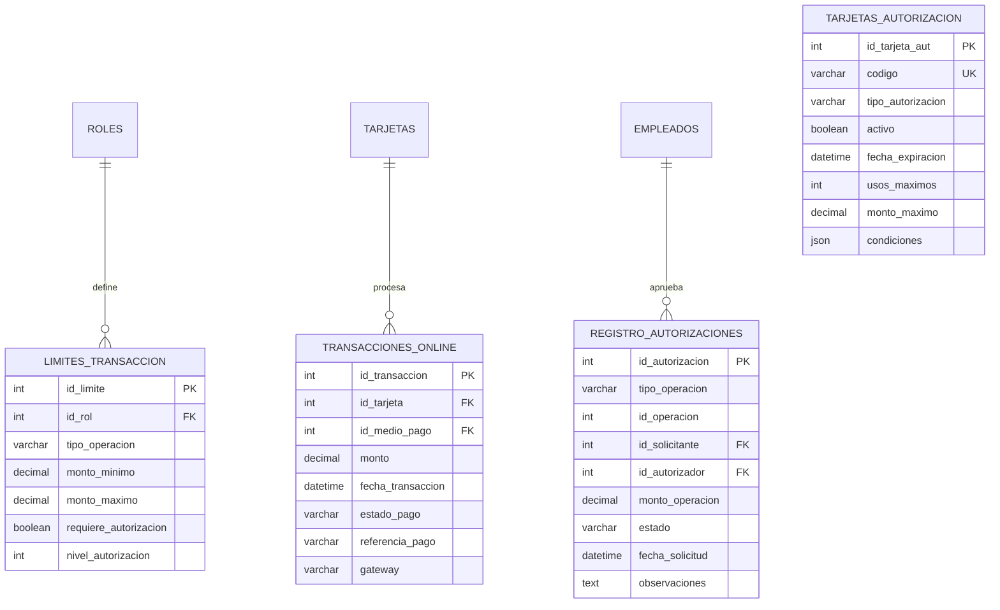
```mermaid
erDiagram
    ROLES ||--o{ LIMITES_TRANSACCION : define
    TARJETAS ||--o{ TRANSACCIONES_ONLINE : procesa
    EMPLEADOS ||--o{ REGISTRO_AUTORIZACIONES : aprueba
    
    TARJETAS_AUTORIZACION {
        int id_tarjeta_aut PK
        varchar codigo UK
        varchar tipo_autorizacion
        boolean activo
        datetime fecha_expiracion
        int usos_maximos
        decimal monto_maximo
        json condiciones
    }
    
    LIMITES_TRANSACCION {
        int id_limite PK
        int id_rol FK
        varchar tipo_operacion
        decimal monto_minimo
        decimal monto_maximo
        boolean requiere_autorizacion
        int nivel_autorizacion
    }
    
    REGISTRO_AUTORIZACIONES {
        int id_autorizacion PK
        varchar tipo_operacion
        int id_operacion
        int id_solicitante FK
        int id_autorizador FK
        decimal monto_operacion
        varchar estado
        datetime fecha_solicitud
        text observaciones
    }
    
    TRANSACCIONES_ONLINE {
        int id_transaccion PK
        int id_tarjeta FK
        int id_medio_pago FK
        decimal monto
        datetime fecha_transaccion
        varchar estado_pago
        varchar referencia_pago
        varchar gateway
    }
```

**Características**:
- Control de límites por rol de empleado
- Autorizaciones con código temporal y usos limitados
- Registro completo de quién autoriza qué operación
- Transacciones online con referencia de gateway de pago

---

## DER CLIENTES
### Módulo CLIENTES - Gestión de Clientes e Hijos

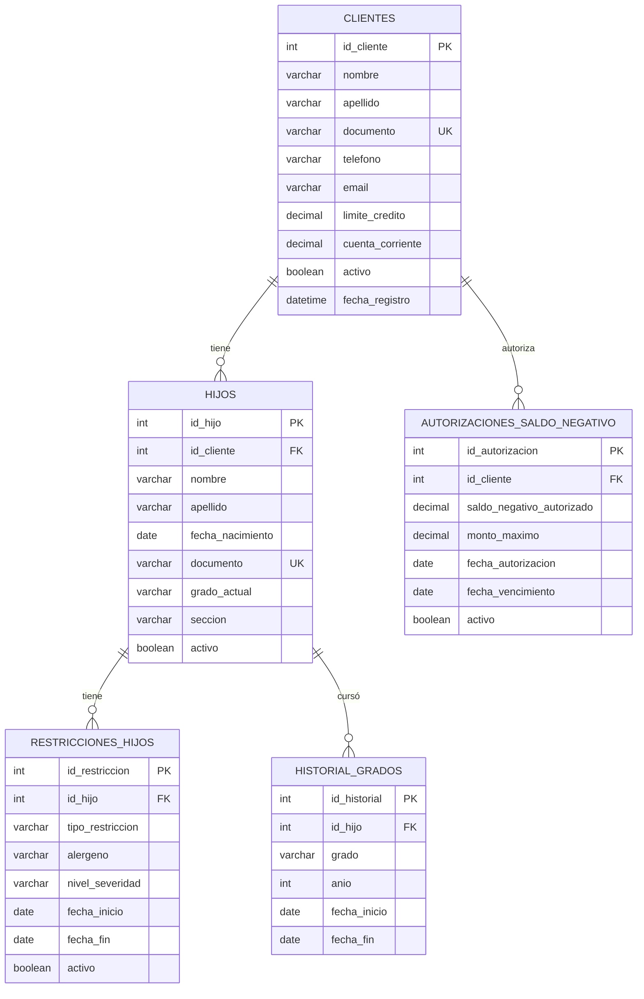
```mermaid
erDiagram
    CLIENTES ||--o{ HIJOS : tiene
    HIJOS ||--o{ RESTRICCIONES_HIJOS : tiene
    HIJOS ||--o{ HISTORIAL_GRADOS : cursó
    CLIENTES ||--o{ AUTORIZACIONES_SALDO_NEGATIVO : autoriza
    
    CLIENTES {
        int id_cliente PK
        varchar nombre
        varchar apellido
        varchar documento UK
        varchar telefono
        varchar email
        decimal limite_credito
        decimal cuenta_corriente
        boolean activo
        datetime fecha_registro
    }
    
    HIJOS {
        int id_hijo PK
        int id_cliente FK
        varchar nombre
        varchar apellido
        date fecha_nacimiento
        varchar documento UK
        varchar grado_actual
        varchar seccion
        boolean activo
    }
    
    RESTRICCIONES_HIJOS {
        int id_restriccion PK
        int id_hijo FK
        varchar tipo_restriccion
        varchar alergeno
        varchar nivel_severidad
        date fecha_inicio
        date fecha_fin
        boolean activo
    }
    
    HISTORIAL_GRADOS {
        int id_historial PK
        int id_hijo FK
        varchar grado
        int anio
        date fecha_inicio
        date fecha_fin
    }
    
    AUTORIZACIONES_SALDO_NEGATIVO {
        int id_autorizacion PK
        int id_cliente FK
        decimal saldo_negativo_autorizado
        decimal monto_maximo
        date fecha_autorizacion
        date fecha_vencimiento
        boolean activo
    }
```

**Reglas de Negocio**:
- Un cliente puede tener múltiples hijos
- Restricciones alimentarias con vigencia temporal
- Autorización de saldo negativo por cliente
- Historial académico completo del estudiante

---

## DER PRODUCTOS - Catálogo
### Módulo PRODUCTOS - Catálogo y Precios

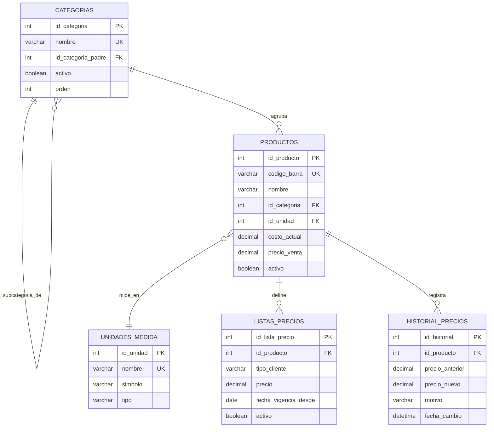
```mermaid
erDiagram
    CATEGORIAS ||--o{ CATEGORIAS : subcategoria_de
    CATEGORIAS ||--o{ PRODUCTOS : agrupa
    PRODUCTOS }o--|| UNIDADES_MEDIDA : mide_en
    PRODUCTOS ||--o{ LISTAS_PRECIOS : define
    PRODUCTOS ||--o{ HISTORIAL_PRECIOS : registra
    
    CATEGORIAS {
        int id_categoria PK
        varchar nombre UK
        int id_categoria_padre FK
        boolean activo
        int orden
    }
    
    PRODUCTOS {
        int id_producto PK
        varchar codigo_barra UK
        varchar nombre
        int id_categoria FK
        int id_unidad FK
        decimal costo_actual
        decimal precio_venta
        boolean activo
    }
    
    UNIDADES_MEDIDA {
        int id_unidad PK
        varchar nombre UK
        varchar simbolo
        varchar tipo
    }
    
    LISTAS_PRECIOS {
        int id_lista_precio PK
        int id_producto FK
        varchar tipo_cliente
        decimal precio
        date fecha_vigencia_desde
        boolean activo
    }
    
    HISTORIAL_PRECIOS {
        int id_historial PK
        int id_producto FK
        decimal precio_anterior
        decimal precio_nuevo
        varchar motivo
        datetime fecha_cambio
    }
```

**Características**:
- Categorías recursivas (árbol infinito)
- Precios diferenciados por tipo de cliente
- Trazabilidad de cambios de precio
- Unidades de medida flexibles

---

## DER INVENTARIO - Stock
### Módulo INVENTARIO - Control de Stock y Lotes

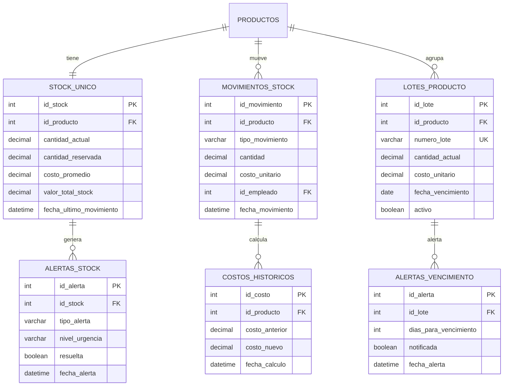
```mermaid
erDiagram
    PRODUCTOS ||--|| STOCK_UNICO : tiene
    PRODUCTOS ||--o{ MOVIMIENTOS_STOCK : mueve
    PRODUCTOS ||--o{ LOTES_PRODUCTO : agrupa
    STOCK_UNICO ||--o{ ALERTAS_STOCK : genera
    LOTES_PRODUCTO ||--o{ ALERTAS_VENCIMIENTO : alerta
    MOVIMIENTOS_STOCK ||--o{ COSTOS_HISTORICOS : calcula
    
    STOCK_UNICO {
        int id_stock PK
        int id_producto FK
        decimal cantidad_actual
        decimal cantidad_reservada
        decimal costo_promedio
        decimal valor_total_stock
        datetime fecha_ultimo_movimiento
    }
    
    MOVIMIENTOS_STOCK {
        int id_movimiento PK
        int id_producto FK
        varchar tipo_movimiento
        decimal cantidad
        decimal costo_unitario
        int id_empleado FK
        datetime fecha_movimiento
    }
    
    LOTES_PRODUCTO {
        int id_lote PK
        int id_producto FK
        varchar numero_lote UK
        decimal cantidad_actual
        decimal costo_unitario
        date fecha_vencimiento
        boolean activo
    }
    
    ALERTAS_STOCK {
        int id_alerta PK
        int id_stock FK
        varchar tipo_alerta
        varchar nivel_urgencia
        boolean resuelta
        datetime fecha_alerta
    }
    
    ALERTAS_VENCIMIENTO {
        int id_alerta PK
        int id_lote FK
        int dias_para_vencimiento
        boolean notificada
        datetime fecha_alerta
    }
    
    COSTOS_HISTORICOS {
        int id_costo PK
        int id_producto FK
        decimal costo_anterior
        decimal costo_nuevo
        datetime fecha_calculo
    }
```

**Algoritmos**:
- Costo promedio ponderado automático
- Control FIFO de lotes
- Alertas por stock mínimo
- Alertas por vencimiento próximo

---

## DER VENTAS
### Módulo VENTAS - Transacciones y Facturación

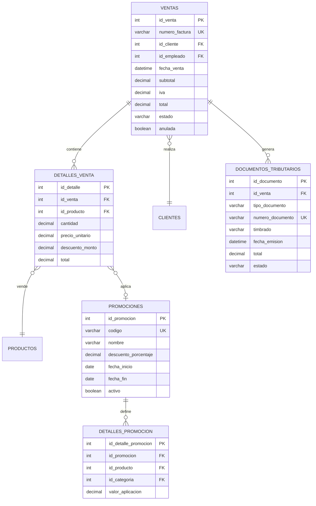
```mermaid
erDiagram
    VENTAS ||--o{ DETALLES_VENTA : contiene
    VENTAS }o--|| CLIENTES : realiza
    VENTAS ||--o{ DOCUMENTOS_TRIBUTARIOS : genera
    DETALLES_VENTA }o--|| PRODUCTOS : vende
    DETALLES_VENTA }o--o| PROMOCIONES : aplica
    PROMOCIONES ||--o{ DETALLES_PROMOCION : define
    
    VENTAS {
        int id_venta PK
        varchar numero_factura UK
        int id_cliente FK
        int id_empleado FK
        datetime fecha_venta
        decimal subtotal
        decimal iva
        decimal total
        varchar estado
        boolean anulada
    }
    
    DETALLES_VENTA {
        int id_detalle PK
        int id_venta FK
        int id_producto FK
        decimal cantidad
        decimal precio_unitario
        decimal descuento_monto
        decimal total
    }
    
    DOCUMENTOS_TRIBUTARIOS {
        int id_documento PK
        int id_venta FK
        varchar tipo_documento
        varchar numero_documento UK
        varchar timbrado
        datetime fecha_emision
        decimal total
        varchar estado
    }
    
    PROMOCIONES {
        int id_promocion PK
        varchar codigo UK
        varchar nombre
        decimal descuento_porcentaje
        date fecha_inicio
        date fecha_fin
        boolean activo
    }
    
    DETALLES_PROMOCION {
        int id_detalle_promocion PK
        int id_promocion FK
        int id_producto FK
        int id_categoria FK
        decimal valor_aplicacion
    }
```

**Flujo**:
1. Crear venta con productos
2. Aplicar promociones automáticamente
3. Generar documento tributario
4. Registrar en caja
5. Descontar stock

---

## DER ALMUERZOS
### Módulo ALMUERZOS - Suscripciones y Menús

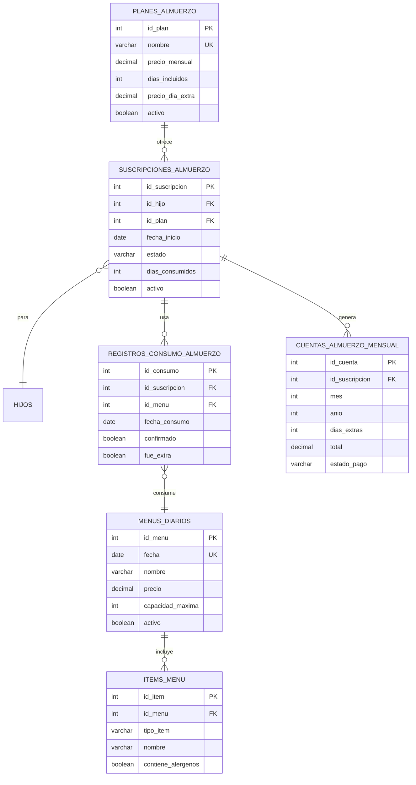
```mermaid
erDiagram
    PLANES_ALMUERZO ||--o{ SUSCRIPCIONES_ALMUERZO : ofrece
    SUSCRIPCIONES_ALMUERZO }o--|| HIJOS : para
    SUSCRIPCIONES_ALMUERZO ||--o{ REGISTROS_CONSUMO_ALMUERZO : usa
    SUSCRIPCIONES_ALMUERZO ||--o{ CUENTAS_ALMUERZO_MENSUAL : genera
    MENUS_DIARIOS ||--o{ ITEMS_MENU : incluye
    REGISTROS_CONSUMO_ALMUERZO }o--|| MENUS_DIARIOS : consume
    
    PLANES_ALMUERZO {
        int id_plan PK
        varchar nombre UK
        decimal precio_mensual
        int dias_incluidos
        decimal precio_dia_extra
        boolean activo
    }
    
    SUSCRIPCIONES_ALMUERZO {
        int id_suscripcion PK
        int id_hijo FK
        int id_plan FK
        date fecha_inicio
        varchar estado
        int dias_consumidos
        boolean activo
    }
    
    MENUS_DIARIOS {
        int id_menu PK
        date fecha UK
        varchar nombre
        decimal precio
        int capacidad_maxima
        boolean activo
    }
    
    ITEMS_MENU {
        int id_item PK
        int id_menu FK
        varchar tipo_item
        varchar nombre
        boolean contiene_alergenos
    }
    
    REGISTROS_CONSUMO_ALMUERZO {
        int id_consumo PK
        int id_suscripcion FK
        int id_menu FK
        date fecha_consumo
        boolean confirmado
        boolean fue_extra
    }
    
    CUENTAS_ALMUERZO_MENSUAL {
        int id_cuenta PK
        int id_suscripcion FK
        int mes
        int anio
        int dias_extras
        decimal total
        varchar estado_pago
    }
```

**Proceso**:
- Suscripción mensual con días incluidos
- Registro diario de consumo
- Cobro de días extras
- Factura mensual automática

---

## DER COMPRAS
### Módulo COMPRAS - Órdenes y Pagos a Proveedores

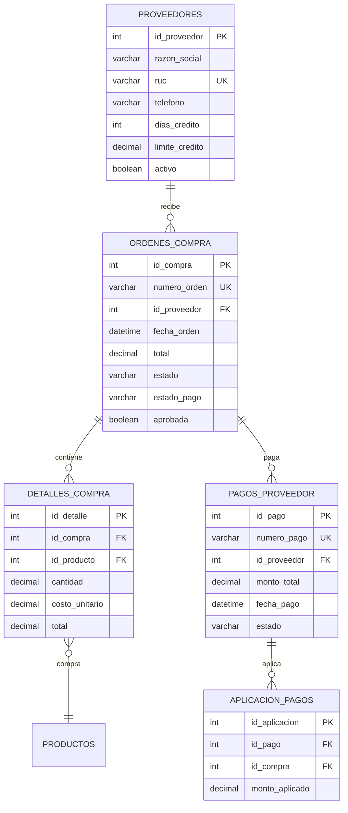
```mermaid
erDiagram
    PROVEEDORES ||--o{ ORDENES_COMPRA : recibe
    ORDENES_COMPRA ||--o{ DETALLES_COMPRA : contiene
    ORDENES_COMPRA ||--o{ PAGOS_PROVEEDOR : paga
    DETALLES_COMPRA }o--|| PRODUCTOS : compra
    PAGOS_PROVEEDOR ||--o{ APLICACION_PAGOS : aplica
    
    PROVEEDORES {
        int id_proveedor PK
        varchar razon_social
        varchar ruc UK
        varchar telefono
        int dias_credito
        decimal limite_credito
        boolean activo
    }
    
    ORDENES_COMPRA {
        int id_compra PK
        varchar numero_orden UK
        int id_proveedor FK
        datetime fecha_orden
        decimal total
        varchar estado
        varchar estado_pago
        boolean aprobada
    }
    
    DETALLES_COMPRA {
        int id_detalle PK
        int id_compra FK
        int id_producto FK
        decimal cantidad
        decimal costo_unitario
        decimal total
    }
    
    PAGOS_PROVEEDOR {
        int id_pago PK
        varchar numero_pago UK
        int id_proveedor FK
        decimal monto_total
        datetime fecha_pago
        varchar estado
    }
    
    APLICACION_PAGOS {
        int id_aplicacion PK
        int id_pago FK
        int id_compra FK
        decimal monto_aplicado
    }
```

**Características**:
- Orden con aprobación requerida
- Pago múltiple (un pago a varias compras)
- Control de crédito por proveedor
- Estado de pago independiente del estado de orden

---

## DER CONTABILIDAD - Cajas
### Módulo CONTABILIDAD - Gestión de Cajas

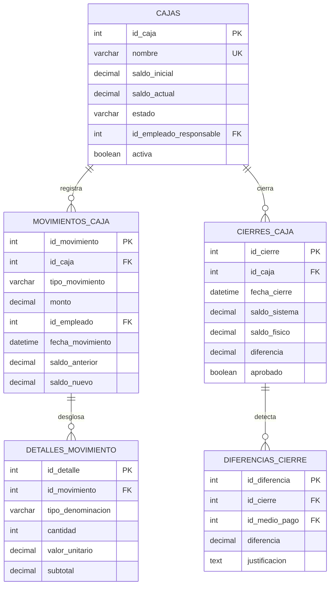
```mermaid
erDiagram
    CAJAS ||--o{ MOVIMIENTOS_CAJA : registra
    CAJAS ||--o{ CIERRES_CAJA : cierra
    MOVIMIENTOS_CAJA ||--o{ DETALLES_MOVIMIENTO : desglosa
    CIERRES_CAJA ||--o{ DIFERENCIAS_CIERRE : detecta
    
    CAJAS {
        int id_caja PK
        varchar nombre UK
        decimal saldo_inicial
        decimal saldo_actual
        varchar estado
        int id_empleado_responsable FK
        boolean activa
    }
    
    MOVIMIENTOS_CAJA {
        int id_movimiento PK
        int id_caja FK
        varchar tipo_movimiento
        decimal monto
        int id_empleado FK
        datetime fecha_movimiento
        decimal saldo_anterior
        decimal saldo_nuevo
    }
    
    DETALLES_MOVIMIENTO {
        int id_detalle PK
        int id_movimiento FK
        varchar tipo_denominacion
        int cantidad
        decimal valor_unitario
        decimal subtotal
    }
    
    CIERRES_CAJA {
        int id_cierre PK
        int id_caja FK
        datetime fecha_cierre
        decimal saldo_sistema
        decimal saldo_fisico
        decimal diferencia
        boolean aprobado
    }
    
    DIFERENCIAS_CIERRE {
        int id_diferencia PK
        int id_cierre FK
        int id_medio_pago FK
        decimal diferencia
        text justificacion
    }
```

**Proceso de Cierre**:
1. Contar efectivo físico
2. Comparar con saldo sistema
3. Registrar diferencias por medio de pago
4. Requiere aprobación si hay faltantes
5. Genera asiento contable

---

## DER CONTABILIDAD - Asientos
### Módulo CONTABILIDAD - Plan de Cuentas y Asientos

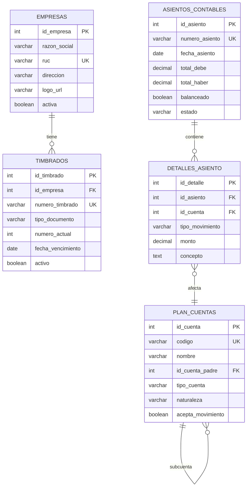
```mermaid
erDiagram
    EMPRESAS ||--o{ TIMBRADOS : tiene
    PLAN_CUENTAS ||--o{ PLAN_CUENTAS : subcuenta
    ASIENTOS_CONTABLES ||--o{ DETALLES_ASIENTO : contiene
    DETALLES_ASIENTO }o--|| PLAN_CUENTAS : afecta
    
    EMPRESAS {
        int id_empresa PK
        varchar razon_social
        varchar ruc UK
        varchar direccion
        varchar logo_url
        boolean activa
    }
    
    TIMBRADOS {
        int id_timbrado PK
        int id_empresa FK
        varchar numero_timbrado UK
        varchar tipo_documento
        int numero_actual
        date fecha_vencimiento
        boolean activo
    }
    
    PLAN_CUENTAS {
        int id_cuenta PK
        varchar codigo UK
        varchar nombre
        int id_cuenta_padre FK
        varchar tipo_cuenta
        varchar naturaleza
        boolean acepta_movimiento
    }
    
    ASIENTOS_CONTABLES {
        int id_asiento PK
        varchar numero_asiento UK
        date fecha_asiento
        decimal total_debe
        decimal total_haber
        boolean balanceado
        varchar estado
    }
    
    DETALLES_ASIENTO {
        int id_detalle PK
        int id_asiento FK
        int id_cuenta FK
        varchar tipo_movimiento
        decimal monto
        text concepto
    }
```

**Características**:
- Plan de cuentas jerárquico
- Asientos con balance automático (debe = haber)
- Timbrados con control de numeración
- Asientos automáticos desde ventas/compras

---

## DER USUARIOS - Auth
### Módulo USUARIOS - Autenticación y Roles

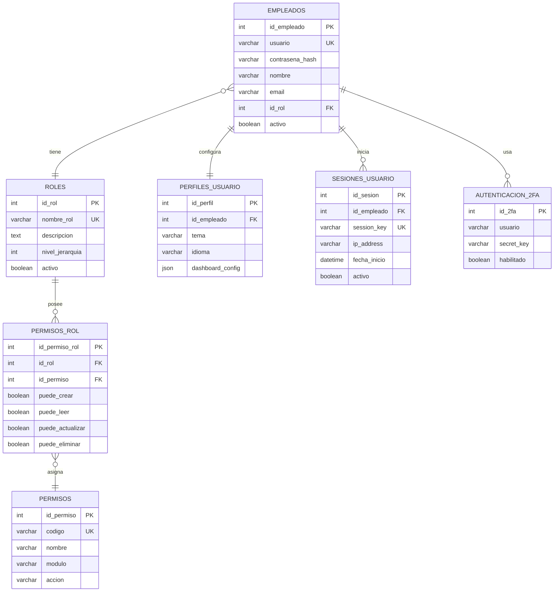
```mermaid
erDiagram
    EMPLEADOS }o--|| ROLES : tiene
    ROLES ||--o{ PERMISOS_ROL : posee
    PERMISOS_ROL }o--|| PERMISOS : asigna
    EMPLEADOS ||--|| PERFILES_USUARIO : configura
    EMPLEADOS ||--o{ SESIONES_USUARIO : inicia
    EMPLEADOS ||--o{ AUTENTICACION_2FA : usa
    
    EMPLEADOS {
        int id_empleado PK
        varchar usuario UK
        varchar contrasena_hash
        varchar nombre
        varchar email
        int id_rol FK
        boolean activo
    }
    
    ROLES {
        int id_rol PK
        varchar nombre_rol UK
        text descripcion
        int nivel_jerarquia
        boolean activo
    }
    
    PERMISOS {
        int id_permiso PK
        varchar codigo UK
        varchar nombre
        varchar modulo
        varchar accion
    }
    
    PERMISOS_ROL {
        int id_permiso_rol PK
        int id_rol FK
        int id_permiso FK
        boolean puede_crear
        boolean puede_leer
        boolean puede_actualizar
        boolean puede_eliminar
    }
    
    PERFILES_USUARIO {
        int id_perfil PK
        int id_empleado FK
        varchar tema
        varchar idioma
        json dashboard_config
    }
    
    SESIONES_USUARIO {
        int id_sesion PK
        int id_empleado FK
        varchar session_key UK
        varchar ip_address
        datetime fecha_inicio
        boolean activo
    }
    
    AUTENTICACION_2FA {
        int id_2fa PK
        varchar usuario
        varchar secret_key
        boolean habilitado
    }
```

**Seguridad**:
- Permisos CRUD granulares
- 2FA para roles críticos
- Sesiones multi-dispositivo
- Jerarquía de roles

---

## DER USUARIOS - Auditoría
### Módulo USUARIOS - Auditoría y Seguridad

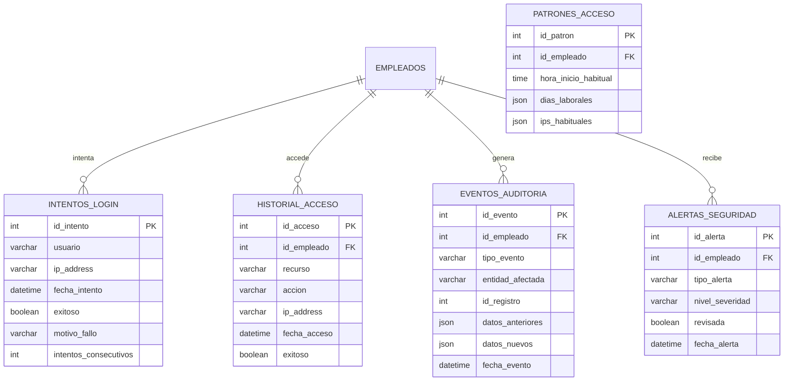
```mermaid
erDiagram
    EMPLEADOS ||--o{ INTENTOS_LOGIN : intenta
    EMPLEADOS ||--o{ HISTORIAL_ACCESO : accede
    EMPLEADOS ||--o{ EVENTOS_AUDITORIA : genera
    EMPLEADOS ||--o{ ALERTAS_SEGURIDAD : recibe
    
    INTENTOS_LOGIN {
        int id_intento PK
        varchar usuario
        varchar ip_address
        datetime fecha_intento
        boolean exitoso
        varchar motivo_fallo
        int intentos_consecutivos
    }
    
    HISTORIAL_ACCESO {
        int id_acceso PK
        int id_empleado FK
        varchar recurso
        varchar accion
        varchar ip_address
        datetime fecha_acceso
        boolean exitoso
    }
    
    EVENTOS_AUDITORIA {
        int id_evento PK
        int id_empleado FK
        varchar tipo_evento
        varchar entidad_afectada
        int id_registro
        json datos_anteriores
        json datos_nuevos
        datetime fecha_evento
    }
    
    ALERTAS_SEGURIDAD {
        int id_alerta PK
        int id_empleado FK
        varchar tipo_alerta
        varchar nivel_severidad
        boolean revisada
        datetime fecha_alerta
    }
    
    PATRONES_ACCESO {
        int id_patron PK
        int id_empleado FK
        time hora_inicio_habitual
        json dias_laborales
        json ips_habituales
    }
```

**Auditoría**:
- Log completo de cambios (antes/después)
- Detección de patrones anómalos
- Bloqueo automático tras intentos fallidos
- Alertas de seguridad en tiempo real

---

## DER REPORTES
### Módulo REPORTES - Plantillas y Dashboards

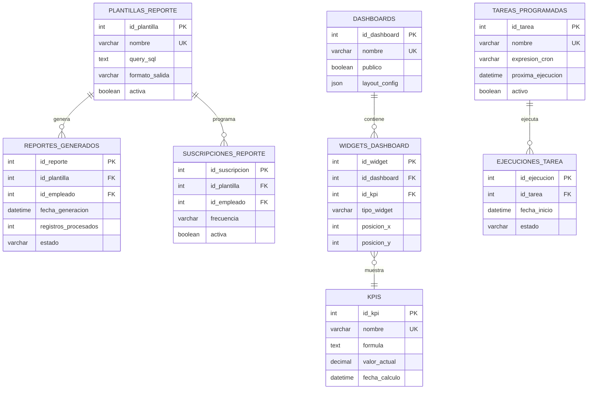
```mermaid
erDiagram
    PLANTILLAS_REPORTE ||--o{ REPORTES_GENERADOS : genera
    PLANTILLAS_REPORTE ||--o{ SUSCRIPCIONES_REPORTE : programa
    DASHBOARDS ||--o{ WIDGETS_DASHBOARD : contiene
    WIDGETS_DASHBOARD }o--|| KPIS : muestra
    TAREAS_PROGRAMADAS ||--o{ EJECUCIONES_TAREA : ejecuta
    
    PLANTILLAS_REPORTE {
        int id_plantilla PK
        varchar nombre UK
        text query_sql
        varchar formato_salida
        boolean activa
    }
    
    REPORTES_GENERADOS {
        int id_reporte PK
        int id_plantilla FK
        int id_empleado FK
        datetime fecha_generacion
        int registros_procesados
        varchar estado
    }
    
    SUSCRIPCIONES_REPORTE {
        int id_suscripcion PK
        int id_plantilla FK
        int id_empleado FK
        varchar frecuencia
        boolean activa
    }
    
    DASHBOARDS {
        int id_dashboard PK
        varchar nombre UK
        boolean publico
        json layout_config
    }
    
    WIDGETS_DASHBOARD {
        int id_widget PK
        int id_dashboard FK
        int id_kpi FK
        varchar tipo_widget
        int posicion_x
        int posicion_y
    }
    
    KPIS {
        int id_kpi PK
        varchar nombre UK
        text formula
        decimal valor_actual
        datetime fecha_calculo
    }
    
    TAREAS_PROGRAMADAS {
        int id_tarea PK
        varchar nombre UK
        varchar expresion_cron
        datetime proxima_ejecucion
        boolean activo
    }
    
    EJECUCIONES_TAREA {
        int id_ejecucion PK
        int id_tarea FK
        datetime fecha_inicio
        varchar estado
    }
```

---

## DER NOTIFICACIONES
### Módulo NOTIFICACIONES - Multi-canal

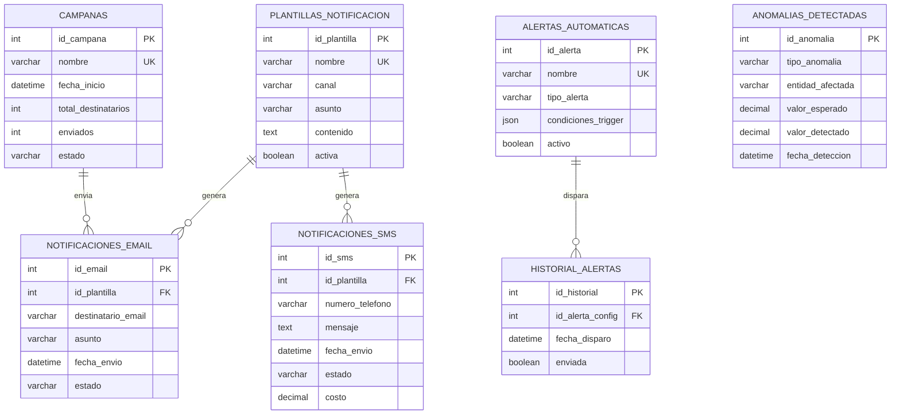
```mermaid
erDiagram
    PLANTILLAS_NOTIFICACION ||--o{ NOTIFICACIONES_EMAIL : genera
    PLANTILLAS_NOTIFICACION ||--o{ NOTIFICACIONES_SMS : genera
    CAMPANAS ||--o{ NOTIFICACIONES_EMAIL : envia
    ALERTAS_AUTOMATICAS ||--o{ HISTORIAL_ALERTAS : dispara
    
    PLANTILLAS_NOTIFICACION {
        int id_plantilla PK
        varchar nombre UK
        varchar canal
        varchar asunto
        text contenido
        boolean activa
    }
    
    NOTIFICACIONES_EMAIL {
        int id_email PK
        int id_plantilla FK
        varchar destinatario_email
        varchar asunto
        datetime fecha_envio
        varchar estado
    }
    
    NOTIFICACIONES_SMS {
        int id_sms PK
        int id_plantilla FK
        varchar numero_telefono
        text mensaje
        datetime fecha_envio
        varchar estado
        decimal costo
    }
    
    CAMPANAS {
        int id_campana PK
        varchar nombre UK
        datetime fecha_inicio
        int total_destinatarios
        int enviados
        varchar estado
    }
    
    ALERTAS_AUTOMATICAS {
        int id_alerta PK
        varchar nombre UK
        varchar tipo_alerta
        json condiciones_trigger
        boolean activo
    }
    
    HISTORIAL_ALERTAS {
        int id_historial PK
        int id_alerta_config FK
        datetime fecha_disparo
        boolean enviada
    }
    
    ANOMALIAS_DETECTADAS {
        int id_anomalia PK
        varchar tipo_anomalia
        varchar entidad_afectada
        decimal valor_esperado
        decimal valor_detectado
        datetime fecha_deteccion
    }
```

**Canales**: Email, SMS, Push, WhatsApp  
**Alertas**: Stock bajo, vencimientos, consumos anómalos

---

## DER API_INTEGRATIONS
### Módulo API - Integraciones Externas

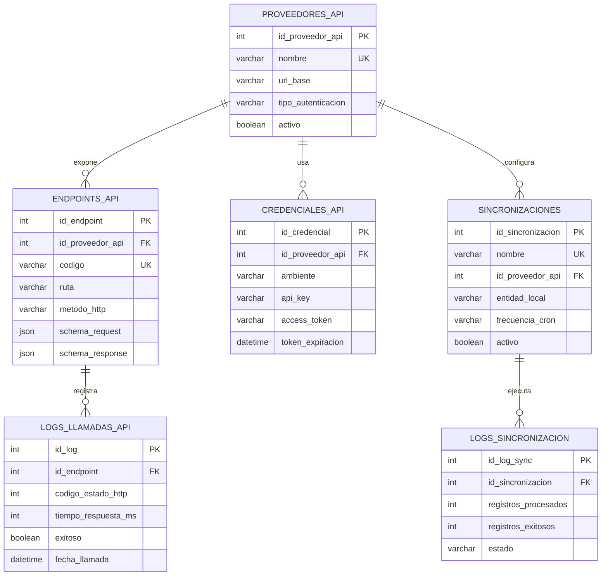
```mermaid
erDiagram
    PROVEEDORES_API ||--o{ ENDPOINTS_API : expone
    PROVEEDORES_API ||--o{ CREDENCIALES_API : usa
    ENDPOINTS_API ||--o{ LOGS_LLAMADAS_API : registra
    PROVEEDORES_API ||--o{ SINCRONIZACIONES : configura
    SINCRONIZACIONES ||--o{ LOGS_SINCRONIZACION : ejecuta
    
    PROVEEDORES_API {
        int id_proveedor_api PK
        varchar nombre UK
        varchar url_base
        varchar tipo_autenticacion
        boolean activo
    }
    
    ENDPOINTS_API {
        int id_endpoint PK
        int id_proveedor_api FK
        varchar codigo UK
        varchar ruta
        varchar metodo_http
        json schema_request
        json schema_response
    }
    
    CREDENCIALES_API {
        int id_credencial PK
        int id_proveedor_api FK
        varchar ambiente
        varchar api_key
        varchar access_token
        datetime token_expiracion
    }
    
    LOGS_LLAMADAS_API {
        int id_log PK
        int id_endpoint FK
        int codigo_estado_http
        int tiempo_respuesta_ms
        boolean exitoso
        datetime fecha_llamada
    }
    
    SINCRONIZACIONES {
        int id_sincronizacion PK
        varchar nombre UK
        int id_proveedor_api FK
        varchar entidad_local
        varchar frecuencia_cron
        boolean activo
    }
    
    LOGS_SINCRONIZACION {
        int id_log_sync PK
        int id_sincronizacion FK
        int registros_procesados
        int registros_exitosos
        varchar estado
    }
```

**Integraciones**: Pagos, Email, SMS, WhatsApp, ERP externos

---

## CASOS DE USO - Clientes
### Gestión de Clientes, Hijos y Tarjetas

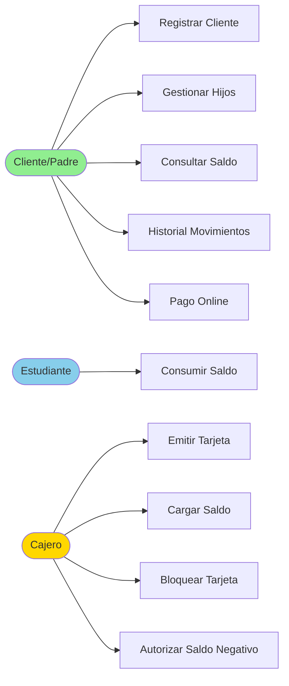
```mermaid
graph LR
    Cliente([Cliente/Padre])
    Estudiante([Estudiante])
    Cajero([Cajero])
    
    UC1[Registrar Cliente]
    UC2[Gestionar Hijos]
    UC3[Emitir Tarjeta]
    UC4[Cargar Saldo]
    UC5[Consultar Saldo]
    UC6[Consumir Saldo]
    UC7[Bloquear Tarjeta]
    UC8[Historial Movimientos]
    UC9[Autorizar Saldo Negativo]
    UC10[Pago Online]
    
    Cliente --> UC1
    Cliente --> UC2
    Cliente --> UC5
    Cliente --> UC8
    Cliente --> UC10
    
    Estudiante --> UC6
    
    Cajero --> UC3
    Cajero --> UC4
    Cajero --> UC7
    Cajero --> UC9
    
    style Cliente fill:#90EE90
    style Estudiante fill:#87CEEB
    style Cajero fill:#FFD700
```

**Descripción**:
- **UC1**: Cliente se registra en el sistema
- **UC2**: Agregar/modificar hijos, restricciones
- **UC3**: Emitir nueva tarjeta prepago
- **UC4**: Cargar saldo (efectivo/transferencia)
- **UC5**: Consultar saldo disponible
- **UC6**: Comprar con tarjeta en cantina
- **UC7**: Bloqueo por pérdida/robo
- **UC8**: Ver movimientos históricos
- **UC9**: Autorizar crédito temporal
- **UC10**: Recarga online con tarjeta de crédito

---

## CASOS DE USO - Ventas
### Ventas, Almuerzos y Facturación

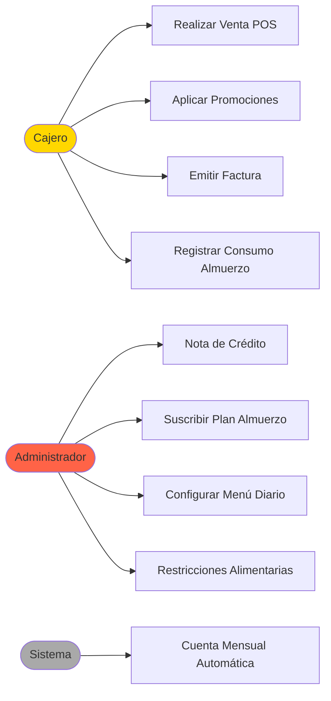
```mermaid
graph LR
    Cajero([Cajero])
    Admin([Administrador])
    Sistema([Sistema])
    
    UC11[Realizar Venta POS]
    UC12[Aplicar Promociones]
    UC13[Emitir Factura]
    UC14[Nota de Crédito]
    UC15[Suscribir Plan Almuerzo]
    UC16[Configurar Menú Diario]
    UC17[Registrar Consumo Almuerzo]
    UC18[Cuenta Mensual Automática]
    UC19[Restricciones Alimentarias]
    
    Cajero --> UC11
    Cajero --> UC12
    Cajero --> UC13
    Cajero --> UC17
    
    Admin --> UC14
    Admin --> UC15
    Admin --> UC16
    Admin --> UC19
    
    Sistema --> UC18
    
    style Cajero fill:#FFD700
    style Admin fill:#FF6347
    style Sistema fill:#A9A9A9
```

**Descripción**:
- **UC11**: Venta en punto de venta
- **UC12**: Descuentos automáticos por promoción
- **UC13**: Factura electrónica (SET Paraguay)
- **UC14**: Devolución/anulación de venta
- **UC15**: Inscribir estudiante en plan mensual
- **UC16**: Definir menú del día
- **UC17**: Marcar asistencia a almuerzo
- **UC18**: Generar factura mensual (cron)
- **UC19**: Gestionar alergias/intolerancias

---

## CASOS DE USO - Inventario
### Inventario, Compras y Stock

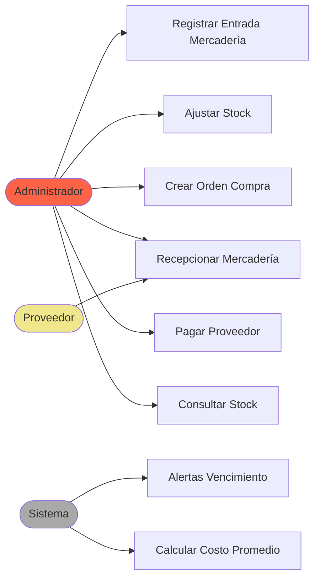
```mermaid
graph LR
    Admin([Administrador])
    Sistema([Sistema])
    Proveedor([Proveedor])
    
    UC20[Registrar Entrada Mercadería]
    UC21[Ajustar Stock]
    UC22[Alertas Vencimiento]
    UC23[Calcular Costo Promedio]
    UC24[Crear Orden Compra]
    UC25[Recepcionar Mercadería]
    UC26[Pagar Proveedor]
    UC27[Consultar Stock]
    
    Admin --> UC20
    Admin --> UC21
    Admin --> UC24
    Admin --> UC25
    Admin --> UC26
    Admin --> UC27
    
    Sistema --> UC22
    Sistema --> UC23
    
    Proveedor --> UC25
    
    style Admin fill:#FF6347
    style Sistema fill:#A9A9A9
    style Proveedor fill:#F0E68C
```

**Descripción**:
- **UC20**: Registrar ingreso de productos
- **UC21**: Ajuste por inventario físico
- **UC22**: Notificar productos por vencer
- **UC23**: Actualizar costo promedio FIFO
- **UC24**: Crear solicitud de compra
- **UC25**: Confirmar entrega de proveedor
- **UC26**: Registrar pago a proveedor
- **UC27**: Verificar disponibilidad

---

## CASOS DE USO - Admin
### Administración y Reportes

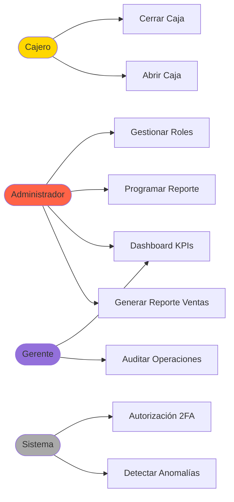
```mermaid
graph LR
    Cajero([Cajero])
    Admin([Administrador])
    Gerente([Gerente])
    Sistema([Sistema])
    
    UC28[Abrir Caja]
    UC29[Cerrar Caja]
    UC30[Generar Reporte Ventas]
    UC31[Dashboard KPIs]
    UC32[Programar Reporte]
    UC33[Gestionar Roles]
    UC34[Auditar Operaciones]
    UC35[Detectar Anomalías]
    UC36[Autorización 2FA]
    
    Cajero --> UC28
    Cajero --> UC29
    
    Admin --> UC30
    Admin --> UC31
    Admin --> UC32
    Admin --> UC33
    
    Gerente --> UC34
    Gerente --> UC31
    
    Sistema --> UC35
    Sistema --> UC36
    
    style Cajero fill:#FFD700
    style Admin fill:#FF6347
    style Gerente fill:#9370DB
    style Sistema fill:#A9A9A9
```

**Descripción**:
- **UC28**: Apertura de caja con saldo inicial
- **UC29**: Cierre con arqueo y diferencias
- **UC30**: Reportes de ventas por período
- **UC31**: Visualizar indicadores clave
- **UC32**: Suscribirse a reportes automáticos
- **UC33**: Asignar permisos a roles
- **UC34**: Revisar log de cambios
- **UC35**: ML para detectar patrones anómalos
- **UC36**: Código temporal por email/SMS

---

## SECUENCIA - Carga Online (1/2)
### Autenticación y Preparación

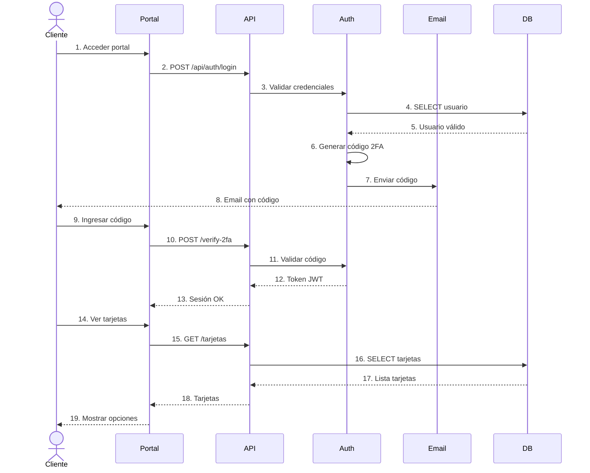
```mermaid
sequenceDiagram
    actor Cliente
    participant Portal
    participant API
    participant Auth
    participant Email
    participant DB
    
    Cliente->>Portal: 1. Acceder portal
    Portal->>API: 2. POST /api/auth/login
    API->>Auth: 3. Validar credenciales
    Auth->>DB: 4. SELECT usuario
    DB-->>Auth: 5. Usuario válido
    
    Auth->>Auth: 6. Generar código 2FA
    Auth->>Email: 7. Enviar código
    Email-->>Cliente: 8. Email con código
    
    Cliente->>Portal: 9. Ingresar código
    Portal->>API: 10. POST /verify-2fa
    API->>Auth: 11. Validar código
    Auth-->>API: 12. Token JWT
    API-->>Portal: 13. Sesión OK
    
    Cliente->>Portal: 14. Ver tarjetas
    Portal->>API: 15. GET /tarjetas
    API->>DB: 16. SELECT tarjetas
    DB-->>API: 17. Lista tarjetas
    API-->>Portal: 18. Tarjetas
    Portal-->>Cliente: 19. Mostrar opciones
```

**Tiempo**: 8-15 segundos  
**Componentes**: Portal React, Django API, 2FA, Email

---

## SECUENCIA - Carga Online (2/2)
### Procesamiento de Pago

```mermaid
sequenceDiagram
    actor Cliente
    participant Portal
    participant API
    participant Gateway
    participant DB
    participant Email
    
    Cliente->>Portal: 1. Seleccionar monto
    Portal->>API: 2. POST /iniciar-carga
    API->>DB: 3. INSERT transaccion PENDIENTE
    API->>Gateway: 4. Iniciar pago
    Gateway-->>API: 5. URL de pago
    API-->>Portal: 6. Redirigir
    
    Cliente->>Gateway: 7. Datos tarjeta
    Gateway->>Gateway: 8. Procesar
    
    alt Pago exitoso
        Gateway->>API: 9a. Webhook APROBADO
        API->>DB: 10a. BEGIN
        API->>DB: 11a. UPDATE tarjetas saldo
        API->>DB: 12a. INSERT carga
        API->>DB: 13a. COMMIT
        API->>Email: 14a. Comprobante
        API-->>Portal: 15a. ✅ Exitoso
    else Rechazado
        Gateway->>API: 9b. Webhook RECHAZADO
        API->>DB: 10b. UPDATE RECHAZADO
        API-->>Portal: 11b. ❌ Error
    end
```

**Tiempo**: 5-30 segundos (según gateway)  
**Gateways**: Bancard, Pagopar

---

## SECUENCIA - Venta POS
### Flujo de Venta con Tarjeta

```mermaid
sequenceDiagram
    actor Estudiante
    participant POS
    participant API
    participant DB
    
    Estudiante->>POS: 1. Presentar tarjeta
    POS->>API: 2. Leer tarjeta
    API->>DB: 3. Verificar tarjeta
    DB-->>API: 4. Saldo: $50.000
    
    Estudiante->>POS: 5. Productos
    POS->>API: 6. Verificar stock
    API-->>POS: 7. Stock OK
    
    POS-->>Estudiante: 8. Total: $15.000
    Estudiante->>POS: 9. Confirmar
    
    POS->>API: 10. POST /ventas
    API->>DB: 11. BEGIN TRANSACTION
    API->>DB: 12. INSERT venta
    API->>DB: 13. INSERT detalles
    API->>DB: 14. UPDATE stock
    API->>DB: 15. UPDATE saldo tarjeta
    API->>DB: 16. INSERT consumo
    API->>DB: 17. INSERT mov_caja
    API->>DB: 18. COMMIT
    
    API-->>POS: 19. ✅ Venta OK
    POS->>POS: 20. Imprimir ticket
    POS-->>Estudiante: 21. Ticket + productos
```

**Tiempo**: 200-400ms  
**Transacción ACID completa**

---

## SECUENCIA - Anomalías
### Detección Automática (Cron cada 15 min)

```mermaid
sequenceDiagram
    participant Cron
    participant Sistema
    participant DB
    participant Email
    
    Cron->>Sistema: 1. Trigger detección
    
    Sistema->>DB: 2a. Stock < mínimo
    DB-->>Sistema: 3a. 15 productos
    Sistema->>Email: 4a. Alerta inventario
    
    Sistema->>DB: 2b. Lotes vencimiento
    DB-->>Sistema: 3b. 8 lotes < 7 días
    Sistema->>Email: 4b. Alerta urgente
    
    Sistema->>DB: 2c. Consumos anómalos
    DB-->>Sistema: 3c. Tarjeta $150k (10x)
    Sistema->>DB: 4c. BLOQUEO automático
    Sistema->>Email: 5c. Alerta crítica
    
    Sistema->>DB: 2d. Intentos login
    DB-->>Sistema: 3d. User: 8 intentos
    Sistema->>DB: 4d. BLOQUEAR cuenta
    Sistema->>Email: 5d. Alerta seguridad
    
    Sistema-->>Cron: 6. Completado (2.3s)
```

**Frecuencia**: Cada 15 minutos  
**Acciones**: Bloqueos preventivos, alertas multi-canal

---

## ARQUITECTURA DE DESPLIEGUE
### Producción - Alta Disponibilidad

```mermaid
graph TB
    subgraph "Usuarios"
        Mobile[📱 App Móvil]
        Web[🌐 Portal Web]
        POS[🖥️ Terminal POS]
    end
    
    subgraph "CDN & LB"
        CDN[CloudFlare CDN]
        LB[Load Balancer<br/>Nginx]
    end
    
    subgraph "Frontend - DMZ"
        FE1[Frontend 1<br/>React + Nginx]
        FE2[Frontend 2<br/>React + Nginx]
    end
    
    subgraph "Backend API"
        API1[API Server 1<br/>Django + Gunicorn]
        API2[API Server 2<br/>Django + Gunicorn]
        API3[API Server 3<br/>Django + Gunicorn]
    end
    
    subgraph "Workers"
        Celery1[Celery Worker 1]
        Celery2[Celery Worker 2]
        Beat[Celery Beat]
    end
    
    subgraph "Cache"
        RedisM[(Redis Master)]
        RedisR[(Redis Replica)]
    end
    
    subgraph "Base de Datos"
        DBM[(SQL Server Primary<br/>Write)]
        DBS1[(SQL Server Replica 1<br/>Read)]
        DBS2[(SQL Server Replica 2<br/>Read)]
    end
    
    subgraph "Monitoreo"
        Prom[Prometheus]
        Graf[Grafana]
        Sentry[Sentry]
    end
    
    Mobile --> CDN
    Web --> CDN
    POS --> LB
    CDN --> LB
    
    LB --> FE1
    LB --> FE2
    
    FE1 --> API1
    FE2 --> API2
    
    API1 --> RedisM
    API2 --> RedisM
    API3 --> RedisM
    
    API1 --> DBM
    API2 --> DBM
    API3 --> DBM
    
    API1 --> DBS1
    API2 --> DBS2
    
    RedisM -.->|Replication| RedisR
    DBM ==>|Replication| DBS1
    DBM ==>|Replication| DBS2
    
    Celery1 --> DBM
    Celery2 --> DBM
    
    API1 -.->|Metrics| Prom
    API2 -.->|Metrics| Prom
    Prom --> Graf
    
    API1 -.->|Errors| Sentry
    
    style Mobile fill:#4CAF50
    style DBM fill:#F44336
    style RedisM fill:#E91E63
```

**Componentes**:
- **3 API Servers**: Auto-scaling horizontal
- **2 SQL Server Replicas**: Lectura balanceada
- **Redis Master-Replica**: Cache de alta disponibilidad
- **Celery Workers**: Procesamiento asíncrono
- **Monitoreo**: Prometheus + Grafana + Sentry

**RPO**: 1 hora | **RTO**: 30 minutos

---

## NOTAS DE IMPRESIÓN

### Configuración Recomendada

**Para Diagramas DER (Páginas 1-15)**:
- **Orientación**: Portrait (vertical)
- **Márgenes**: 0.5" en todos los lados
- **Escala**: 100% (ajustar a página si es necesario)

**Para Casos de Uso (Páginas 16-19)**:
- **Orientación**: Portrait o Landscape según preferencia
- **Márgenes**: 0.5"
- **Escala**: Fit to page

**Para Secuencias (Páginas 20-23)**:
- **Orientación**: Portrait
- **Márgenes**: 0.5"
- **Escala**: 90-100%

**Para Despliegue (Página 24)**:
- **Orientación**: Landscape (horizontal) RECOMENDADO
- **Márgenes**: 0.5"
- **Escala**: Fit to width

### Herramientas de Renderizado

Para mejor calidad de impresión:

1. **VS Code** con extensión Mermaid Preview
2. **Mermaid Live Editor** (https://mermaid.live)
3. **Export to PNG/PDF** con resolución 300 DPI

### Control de Versiones

| Versión | Fecha | Cambios |
|---------|-------|---------|
| 1.0 Carta | 2026-03-06 | Optimización para impresión tamaño carta |

---

**© 2026 Cantina TITA - Documentación de Arquitectura**
