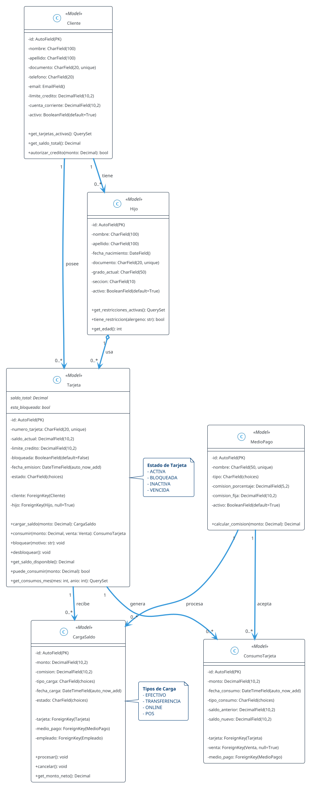
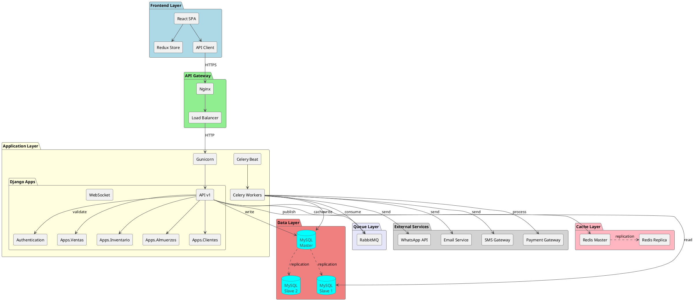
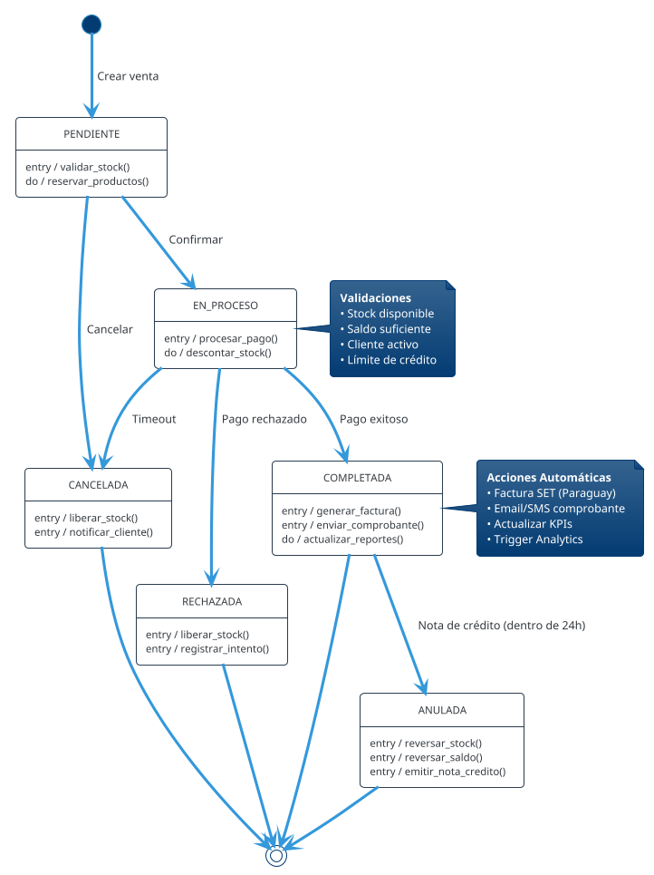
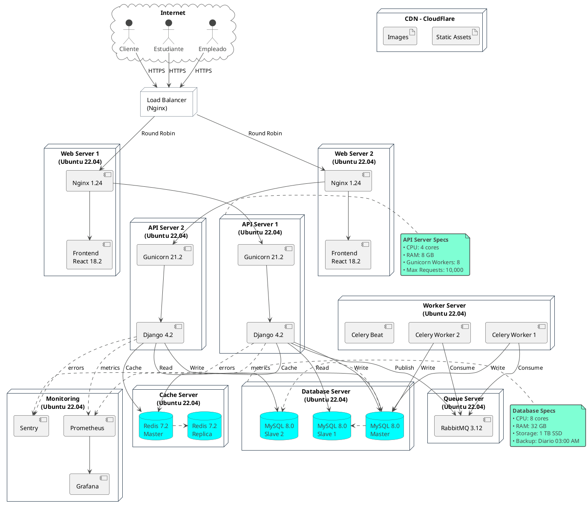
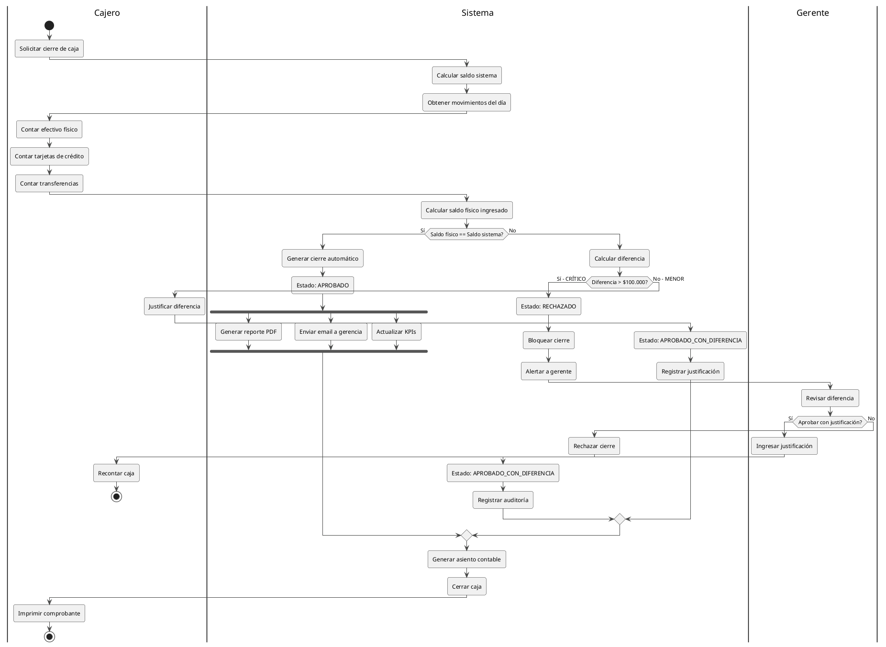
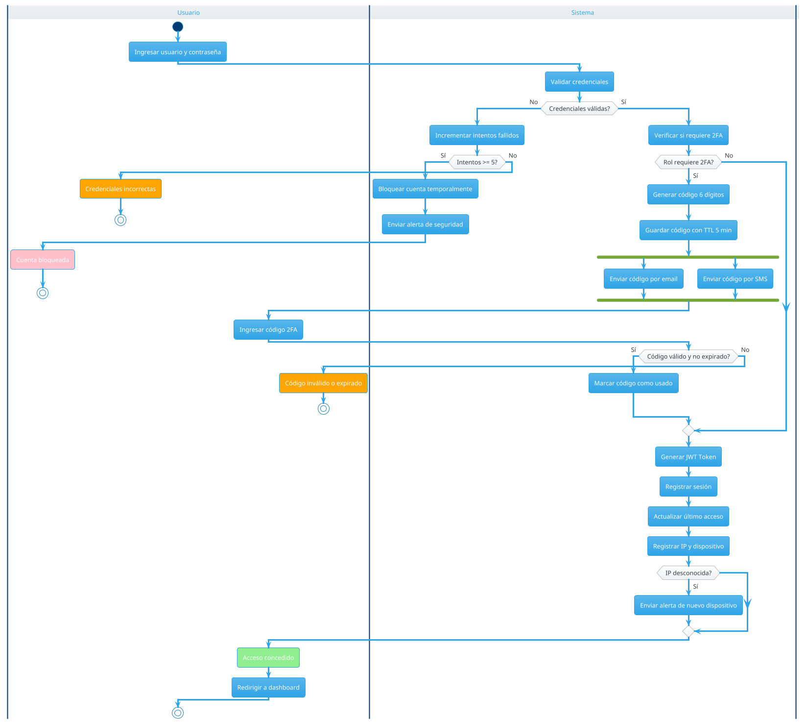

# EJEMPLOS PlantUML - CANTINA TITA
## Diagramas Complementarios a Mermaid

> **Nota**: PlantUML ofrece mayor detalle para diagramas UML complejos.
> Para ver estos diagramas, presiona `Alt+D` en VS Code.

---

## 📚 Diagrama de Clases - Modelos Django CORE

### Tarjetas con Métodos y Propiedades



---

## 🏗️ Diagrama de Componentes - Arquitectura Backend



---

## 🔄 Diagrama de Estados - Ciclo de Vida de Venta



---

## 📦 Diagrama de Deployment - Producción



---

## 🎯 Diagrama de Actividad - Proceso de Cierre de Caja



---

## 🔐 Diagrama de Actividad - Autenticación 2FA



---

## 📋 Cómo usar estos diagramas

### Ver en VS Code
1. Abrir este archivo `.md`
2. Presionar `Alt+D` para preview PlantUML
3. Click derecho → "Export Current Diagram" para generar imagen

### Exportar para documentación
```bash
# Los diagramas se exportan automáticamente a:
docs/diagramas/
```

### Integrar en Markdown
```markdown

```

---

## 🎯 Cuándo usar PlantUML vs Mermaid

| Tipo de Diagrama | Mermaid ⭐ | PlantUML 🔧 |
|------------------|-----------|-------------|
| ERD básico | ✅ Mejor | ⚠️ Overkill |
| Clases con métodos | ❌ Limitado | ✅ Mejor |
| Secuencia simple | ✅ Mejor | ⚠️ Igual |
| Secuencia compleja | ⚠️ Limitado | ✅ Mejor |
| Casos de uso | ✅ Mejor | ⚠️ Verboso |
| Componentes | ⚠️ Básico | ✅ Mejor |
| Deployment | ⚠️ Básico | ✅ Mejor |
| Estados | ✅ Bueno | ✅ Mejor |
| Actividad | ❌ No tiene | ✅ Solo PlantUML |

**Recomendación**: Usa Mermaid para documentación versionada en Git, PlantUML para diagramas técnicos complejos.
