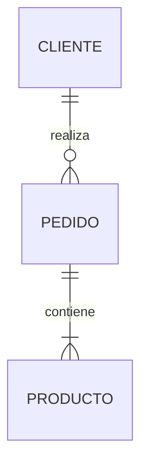
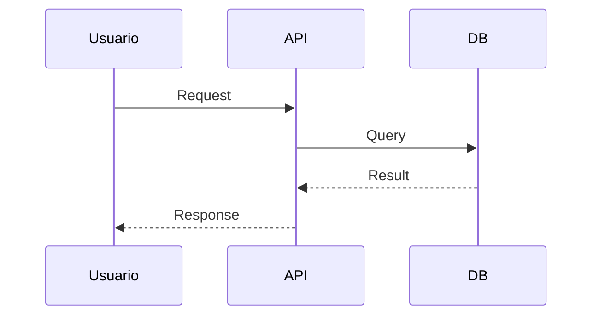
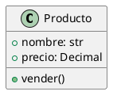
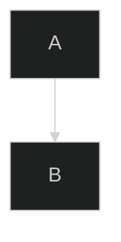

# 🚀 GUÍA RÁPIDA - MERMAID & PLANTUML
## Atajos y Comandos para VS Code

---

## ⚡ Atajos de Teclado

### Markdown + Mermaid
| Acción | Atajo | Descripción |
|--------|-------|-------------|
| **Preview Markdown** | `Ctrl+K V` | Abrir preview lado a lado |
| **Preview solo** | `Ctrl+Shift+V` | Preview en pestaña nueva |
| **Refresh preview** | `Ctrl+R` | Refrescar diagrama |
| **Zoom in** | `Ctrl++` | Acercar vista |
| **Zoom out** | `Ctrl+-` | Alejar vista |

### PlantUML
| Acción | Atajo | Descripción |
|--------|-------|-------------|
| **Preview PlantUML** | `Alt+D` | Ver diagrama PlantUML |
| **Exportar diagrama** | Click derecho → Export | Guardar como SVG/PNG |
| **Exportar todos** | `Ctrl+Shift+P` → PlantUML: Export All | Exportar workspace |

### Snippets (Atajos de código)
| Snippet | Resultado | Uso |
|---------|-----------|-----|
| `mmd-erd` + Tab | ERD Mermaid | Diagrama entidad-relación |
| `mmd-seq` + Tab | Secuencia Mermaid | Diagrama de secuencia |
| `mmd-usecase` + Tab | Casos de Uso | Casos de uso |
| `mmd-flow` + Tab | Flowchart | Diagrama de flujo |
| `puml-class` + Tab | Clases Django | Diagrama de clases |
| `puml-component` + Tab | Componentes | Arquitectura |
| `puml-state` + Tab | Estados | Máquina de estados |
| `puml-deploy` + Tab | Deployment | Infraestructura |

---

## 📝 Comandos de Paleta (Ctrl+Shift+P)

### Mermaid
```
Markdown: Open Preview to the Side
Markdown: Toggle Preview Locking
Mermaid Preview: Open Preview
```

### PlantUML
```
PlantUML: Preview Current Diagram
PlantUML: Export Current Diagram
PlantUML: Export Workspace Diagrams
PlantUML: Export Current File Diagrams
PlantUML: URL Current Diagram
```

---

## 🎨 Sintaxis Rápida

### Mermaid - ERD


### Mermaid - Secuencia


### PlantUML - Clases


---

## 📊 Formatos de Exportación

### Mermaid (con extensión)
- **SVG** (vectorial, calidad infinita) ⭐ Recomendado
- **PNG** (rasterizado, 300 DPI para impresión)

### PlantUML
- **SVG** ⭐ Mejor calidad
- **PNG** (alta resolución)
- **PDF** (documentos)
- **EPS** (publicaciones)

---

## 🎯 Workflow Recomendado

### 1️⃣ Crear Diagrama Mermaid (en .md)
```bash
# En tu archivo de documentación
docs/ARQUITECTURA.md
```
1. Escribir código Mermaid
2. `Ctrl+K V` para preview
3. Editar en tiempo real
4. Commit a Git (se ve en GitHub)

### 2️⃣ Crear Diagrama PlantUML (archivos .puml)
```bash
# Crear archivo dedicado
docs/diagramas/clases_core.puml
```
1. Escribir código PlantUML
2. `Alt+D` para preview
3. Click derecho → Export → SVG
4. Incluir en Markdown:
   ```markdown
   
   ```

---

## 🔥 Tips Pro

### Mermaid
✅ Usa en archivos `.md` para documentación versionada  
✅ Se renderiza automáticamente en GitHub/GitLab  
✅ Perfecto para README, ARCHITECTURE, API docs  
✅ Cambios visibles en pull requests  

### PlantUML
✅ Usa para diagramas UML complejos (clases con métodos)  
✅ Mejor control de estilos y temas  
✅ Exportación profesional de alta calidad  
✅ Incluye SVG generado en el repo  

### Ambos
✅ **Mermaid en Markdown** para documentación diaria  
✅ **PlantUML en archivos .puml** para diagramas técnicos  
✅ Combinar según necesidad  

---

## 🎨 Temas y Estilos

### Mermaid - Cambiar tema


Temas disponibles:
- `default` (claro)
- `dark` (oscuro)
- `forest` (verde)
- `neutral` (gris)

### PlantUML - Aplicar skin
```plantuml
@startuml
!theme cerulean
' Otros: vibrant, spacelab, superhero
@enduml
```

---

## 🐛 Troubleshooting

### Mermaid no se renderiza
1. ✅ Verificar extensión instalada: `bierner.markdown-mermaid`
2. ✅ Recargar VS Code: `Ctrl+Shift+P` → Reload Window
3. ✅ Verificar sintaxis en https://mermaid.live

### PlantUML sin preview
1. ✅ Verificar extensión instalada: `jebbs.plantuml`
2. ✅ Verificar internet (usa servidor online)
3. ✅ Alternativa local: Instalar Java + GraphViz

### Exportación de baja calidad
```json
// settings.json
{
  "plantuml.exportScale": 3.0,  // Mayor = mejor calidad
  "mermaid.exportScale": 3.0
}
```

---

## 📚 Referencias Rápidas

### Documentación Oficial
- **Mermaid**: https://mermaid.js.org/
- **PlantUML**: https://plantuml.com/
- **Mermaid Live**: https://mermaid.live/ (editor online)
- **PlantUML Server**: https://www.plantuml.com/plantuml/

### Galería de Ejemplos
- **Mermaid Examples**: https://mermaid.js.org/ecosystem/integrations.html
- **PlantUML Examples**: https://real-world-plantuml.com/

---

## ✨ Tu Setup Actual

✅ **Extensiones instaladas**:
- `bierner.markdown-mermaid` - Preview Mermaid en Markdown
- `vstirbu.vscode-mermaid-preview` - Vista dedicada
- `jebbs.plantuml` - PlantUML completo

✅ **Configuración aplicada**:
- Preview automático en Markdown
- Exportación a `docs/diagramas/`
- Snippets personalizados cargados
- Escala 3.0 para exportación HD

✅ **Archivos creados**:
- `.vscode/settings.json` - Configuración VS Code
- `.vscode/diagram-snippets.code-snippets` - Atajos
- `docs/EJEMPLOS_PLANTUML.md` - Ejemplos completos
- `docs/DIAGRAMAS_ARQUITECTURA.md` - Diagramas Mermaid
- `docs/DIAGRAMAS_ARQUITECTURA_CARTA.md` - Optimizado impresión

---

## 🎯 Próximos Pasos

1. **Probar snippets**: Abrir archivo `.md`, escribir `mmd-erd` + Tab
2. **Ver ejemplos**: Abrir `docs/EJEMPLOS_PLANTUML.md` → `Alt+D`
3. **Exportar diagrama**: Click derecho en preview → Export
4. **Personalizar**: Editar `.vscode/diagram-snippets.code-snippets`

**¡Listo para crear diagramas profesionales! 🚀**
